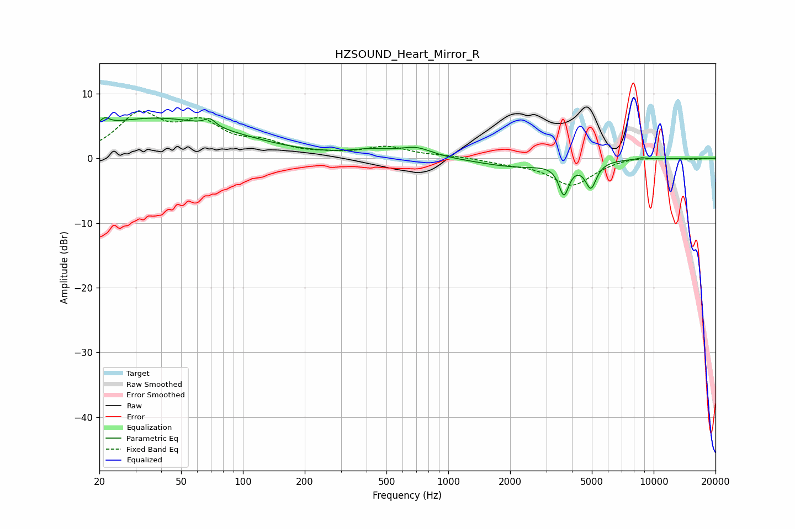

# HZSOUND_Heart_Mirror_R
See [usage instructions](https://github.com/jaakkopasanen/AutoEq#usage) for more options and info.

### Parametric EQs
Apply preamp of -6.3 dB when using parametric equalizer.

|   # | Type    |   Fc (Hz) |    Q |   Gain (dB) |
|-----|---------|-----------|------|-------------|
|   1 | Peaking |        21 | 5.9  |         1.1 |
|   2 | Peaking |        38 | 0.37 |         6.1 |
|   3 | Peaking |        69 | 5.51 |         1.1 |
|   4 | Peaking |       419 | 1.45 |         0.9 |
|   5 | Peaking |       696 | 1.72 |         1.5 |
|   6 | Peaking |      2149 | 0.8  |        -1.3 |
|   7 | Peaking |      3655 | 5.74 |        -4.7 |
|   8 | Peaking |      4945 | 4.18 |        -1.5 |
|   9 | Peaking |      4946 | 6    |        -2.5 |
|  10 | Peaking |      8766 | 5.83 |         0.3 |

### Fixed Band EQs
When using fixed band (also called graphic) equalizer, apply preamp of **-7.4 dB** (if available) and set gains manually with these parameters.

|   # | Type    |   Fc (Hz) |    Q |   Gain (dB) |
|-----|---------|-----------|------|-------------|
|   1 | Peaking |        31 | 1.41 |         6.3 |
|   2 | Peaking |        62 | 1.41 |         4.6 |
|   3 | Peaking |       125 | 1.41 |         1.9 |
|   4 | Peaking |       250 | 1.41 |         0.4 |
|   5 | Peaking |       500 | 1.41 |         1.7 |
|   6 | Peaking |      1000 | 1.41 |         0.3 |
|   7 | Peaking |      2000 | 1.41 |        -0.6 |
|   8 | Peaking |      4000 | 1.41 |        -4.1 |
|   9 | Peaking |      8000 | 1.41 |         0.4 |
|  10 | Peaking |     16000 | 1.41 |        -0.1 |

### Graphs

