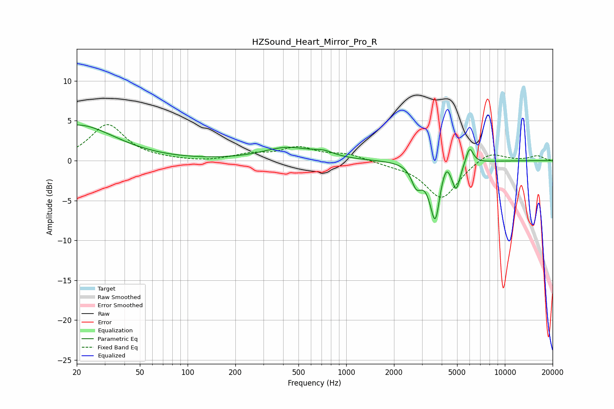

# HZSound_Heart_Mirror_Pro_R
See [usage instructions](https://github.com/jaakkopasanen/AutoEq#usage) for more options and info.

### Parametric EQs
Apply preamp of -4.6 dB when using parametric equalizer.

|   # | Type    |   Fc (Hz) |    Q |   Gain (dB) |
|-----|---------|-----------|------|-------------|
|   1 | Peaking |        20 | 0.6  |         4.5 |
|   2 | Peaking |       423 | 0.91 |         1.6 |
|   3 | Peaking |       722 | 2.21 |         0.6 |
|   4 | Peaking |      2754 | 4.84 |        -2   |
|   5 | Peaking |      2915 | 3.85 |        -0.6 |
|   6 | Peaking |      3657 | 4.09 |        -7.9 |
|   7 | Peaking |      3907 | 6    |         1.3 |
|   8 | Peaking |      4269 | 6    |         1.6 |
|   9 | Peaking |      4935 | 5.8  |        -3.1 |
|  10 | Peaking |      5995 | 6    |         2.1 |

### Fixed Band EQs
When using fixed band (also called graphic) equalizer, apply preamp of **-4.6 dB** (if available) and set gains manually with these parameters.

|   # | Type    |   Fc (Hz) |    Q |   Gain (dB) |
|-----|---------|-----------|------|-------------|
|   1 | Peaking |        31 | 1.41 |         4.5 |
|   2 | Peaking |        62 | 1.41 |         0.1 |
|   3 | Peaking |       125 | 1.41 |        -0.2 |
|   4 | Peaking |       250 | 1.41 |         0.7 |
|   5 | Peaking |       500 | 1.41 |         1.5 |
|   6 | Peaking |      1000 | 1.41 |         0.8 |
|   7 | Peaking |      2000 | 1.41 |        -0.4 |
|   8 | Peaking |      4000 | 1.41 |        -4.8 |
|   9 | Peaking |      8000 | 1.41 |         1.3 |
|  10 | Peaking |     16000 | 1.41 |         0.6 |

### Graphs

