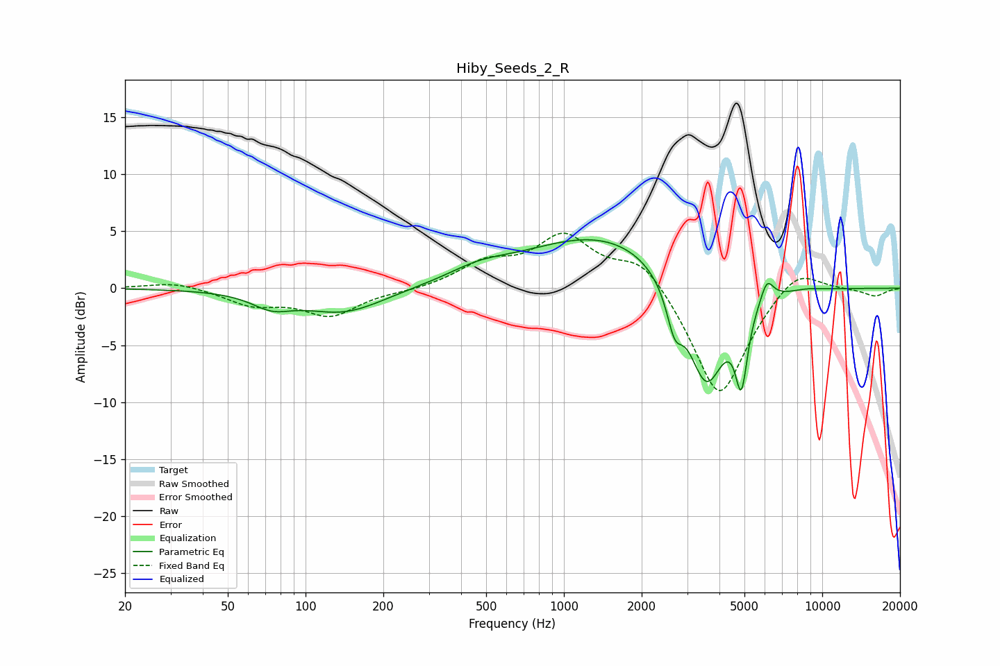

# Hiby_Seeds_2_R
See [usage instructions](https://github.com/jaakkopasanen/AutoEq#usage) for more options and info.

### Parametric EQs
Apply preamp of -4.3 dB when using parametric equalizer.

|   # | Type    |   Fc (Hz) |    Q |   Gain (dB) |
|-----|---------|-----------|------|-------------|
|   1 | Peaking |        74 | 1.84 |        -1.2 |
|   2 | Peaking |       141 | 0.89 |        -2.2 |
|   3 | Peaking |       465 | 1.26 |         0.9 |
|   4 | Peaking |      1340 | 0.46 |         4.2 |
|   5 | Peaking |      1891 | 0.68 |         0.8 |
|   6 | Peaking |      2681 | 4.74 |        -3.2 |
|   7 | Peaking |      3554 | 1.79 |        -9.8 |
|   8 | Peaking |      4865 | 5.99 |        -6.5 |
|   9 | Peaking |      6106 | 5.46 |         2   |
|  10 | Peaking |      8782 | 2.84 |         0.1 |

### Fixed Band EQs
When using fixed band (also called graphic) equalizer, apply preamp of **-4.9 dB** (if available) and set gains manually with these parameters.

|   # | Type    |   Fc (Hz) |    Q |   Gain (dB) |
|-----|---------|-----------|------|-------------|
|   1 | Peaking |        31 | 1.41 |         0.6 |
|   2 | Peaking |        62 | 1.41 |        -1.4 |
|   3 | Peaking |       125 | 1.41 |        -2.3 |
|   4 | Peaking |       250 | 1.41 |        -0.2 |
|   5 | Peaking |       500 | 1.41 |         2   |
|   6 | Peaking |      1000 | 1.41 |         4.4 |
|   7 | Peaking |      2000 | 1.41 |         2.8 |
|   8 | Peaking |      4000 | 1.41 |        -9.9 |
|   9 | Peaking |      8000 | 1.41 |         2.2 |
|  10 | Peaking |     16000 | 1.41 |        -0.7 |

### Graphs

