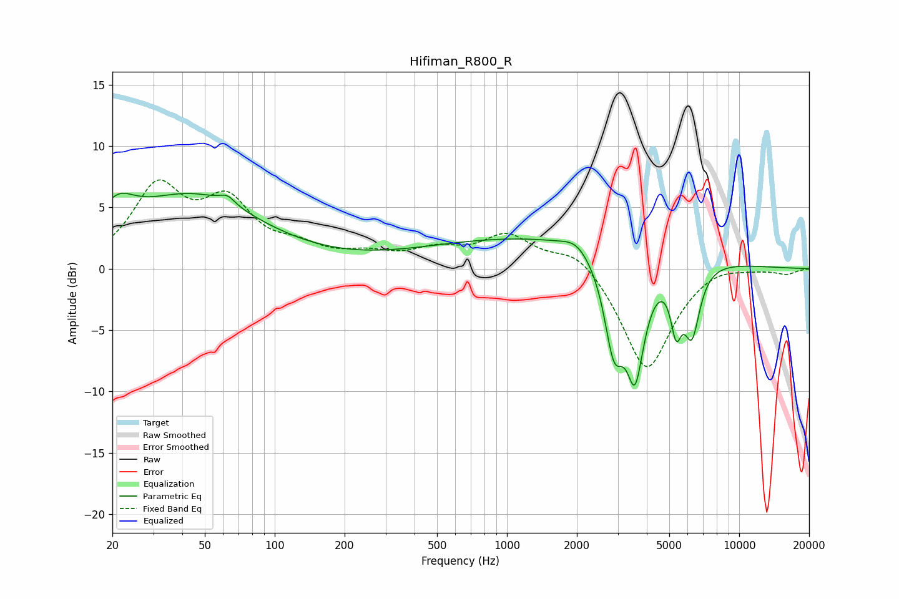

# Hifiman_R800_R
See [usage instructions](https://github.com/jaakkopasanen/AutoEq#usage) for more options and info.

### Parametric EQs
Apply preamp of -6.2 dB when using parametric equalizer.

|   # | Type    |   Fc (Hz) |    Q |   Gain (dB) |
|-----|---------|-----------|------|-------------|
|   1 | Peaking |        21 | 1.91 |         2.5 |
|   2 | Peaking |        44 | 0.49 |         5.8 |
|   3 | Peaking |        63 | 4.38 |         0.7 |
|   4 | Peaking |      1593 | 0.24 |         2.7 |
|   5 | Peaking |      1985 | 2.6  |         0.8 |
|   6 | Peaking |      2885 | 3.38 |        -6.7 |
|   7 | Peaking |      3475 | 4.62 |         1.6 |
|   8 | Peaking |      3544 | 3.37 |       -10.7 |
|   9 | Peaking |      5351 | 5.81 |        -4.2 |
|  10 | Peaking |      6254 | 3.89 |        -5.6 |

### Fixed Band EQs
When using fixed band (also called graphic) equalizer, apply preamp of **-7.3 dB** (if available) and set gains manually with these parameters.

|   # | Type    |   Fc (Hz) |    Q |   Gain (dB) |
|-----|---------|-----------|------|-------------|
|   1 | Peaking |        31 | 1.41 |         6.2 |
|   2 | Peaking |        62 | 1.41 |         4.8 |
|   3 | Peaking |       125 | 1.41 |         1.3 |
|   4 | Peaking |       250 | 1.41 |         0.9 |
|   5 | Peaking |       500 | 1.41 |         1.3 |
|   6 | Peaking |      1000 | 1.41 |         2.6 |
|   7 | Peaking |      2000 | 1.41 |         1.7 |
|   8 | Peaking |      4000 | 1.41 |        -8.5 |
|   9 | Peaking |      8000 | 1.41 |         0.6 |
|  10 | Peaking |     16000 | 1.41 |        -0.4 |

### Graphs

