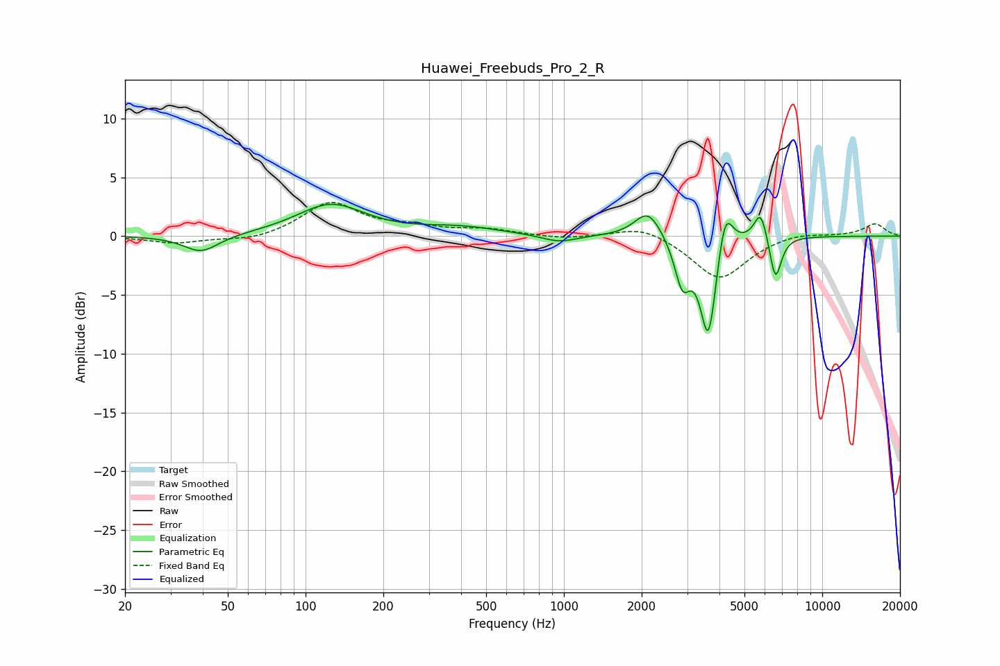

# Huawei_Freebuds_Pro_2_R
See [usage instructions](https://github.com/jaakkopasanen/AutoEq#usage) for more options and info.

### Parametric EQs
Apply preamp of -2.8 dB when using parametric equalizer.

|   # | Type    |   Fc (Hz) |    Q |   Gain (dB) |
|-----|---------|-----------|------|-------------|
|   1 | Peaking |        39 | 2.08 |        -1.5 |
|   2 | Peaking |       125 | 1.08 |         2.7 |
|   3 | Peaking |       397 | 0.91 |         0.7 |
|   4 | Peaking |       957 | 2.07 |        -0.6 |
|   5 | Peaking |      2120 | 2.73 |         2.4 |
|   6 | Peaking |      2876 | 4.71 |        -3.8 |
|   7 | Peaking |      3627 | 4.38 |        -8.9 |
|   8 | Peaking |      4203 | 4.81 |         3.9 |
|   9 | Peaking |      5780 | 5.44 |         2.6 |
|  10 | Peaking |      6590 | 6    |        -3.9 |

### Fixed Band EQs
When using fixed band (also called graphic) equalizer, apply preamp of **-3.0 dB** (if available) and set gains manually with these parameters.

|   # | Type    |   Fc (Hz) |    Q |   Gain (dB) |
|-----|---------|-----------|------|-------------|
|   1 | Peaking |        31 | 1.41 |        -0.6 |
|   2 | Peaking |        62 | 1.41 |        -0.4 |
|   3 | Peaking |       125 | 1.41 |         2.8 |
|   4 | Peaking |       250 | 1.41 |         0.6 |
|   5 | Peaking |       500 | 1.41 |         0.5 |
|   6 | Peaking |      1000 | 1.41 |        -0.3 |
|   7 | Peaking |      2000 | 1.41 |         1   |
|   8 | Peaking |      4000 | 1.41 |        -3.7 |
|   9 | Peaking |      8000 | 1.41 |         0.4 |
|  10 | Peaking |     16000 | 1.41 |         1.1 |

### Graphs

