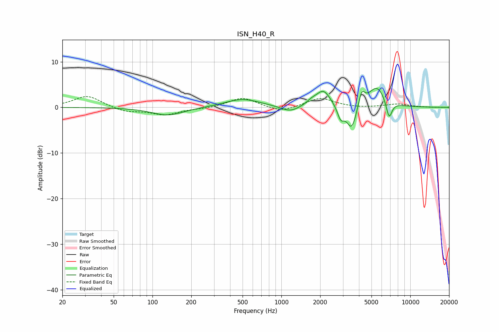

# ISN_H40_R
See [usage instructions](https://github.com/jaakkopasanen/AutoEq#usage) for more options and info.

### Parametric EQs
Apply preamp of -4.3 dB when using parametric equalizer.

|   # | Type    |   Fc (Hz) |    Q |   Gain (dB) |
|-----|---------|-----------|------|-------------|
|   1 | Peaking |       132 | 1.15 |        -1.8 |
|   2 | Peaking |       498 | 1.05 |         1.8 |
|   3 | Peaking |      1170 | 2.01 |        -1.3 |
|   4 | Peaking |      1715 | 3.71 |         0.7 |
|   5 | Peaking |      2118 | 2.49 |         3.7 |
|   6 | Peaking |      2887 | 5.44 |        -2.7 |
|   7 | Peaking |      3513 | 3.63 |        -5.5 |
|   8 | Peaking |      4195 | 5.71 |         3.4 |
|   9 | Peaking |      5495 | 2.09 |         4.6 |
|  10 | Peaking |      6850 | 6    |        -4   |

### Fixed Band EQs
When using fixed band (also called graphic) equalizer, apply preamp of **-2.5 dB** (if available) and set gains manually with these parameters.

|   # | Type    |   Fc (Hz) |    Q |   Gain (dB) |
|-----|---------|-----------|------|-------------|
|   1 | Peaking |        31 | 1.41 |         2.6 |
|   2 | Peaking |        62 | 1.41 |        -1   |
|   3 | Peaking |       125 | 1.41 |        -1.6 |
|   4 | Peaking |       250 | 1.41 |        -0.3 |
|   5 | Peaking |       500 | 1.41 |         2.2 |
|   6 | Peaking |      1000 | 1.41 |        -1.1 |
|   7 | Peaking |      2000 | 1.41 |         2.1 |
|   8 | Peaking |      4000 | 1.41 |        -0.2 |
|   9 | Peaking |      8000 | 1.41 |         0.7 |
|  10 | Peaking |     16000 | 1.41 |        -0   |

### Graphs

