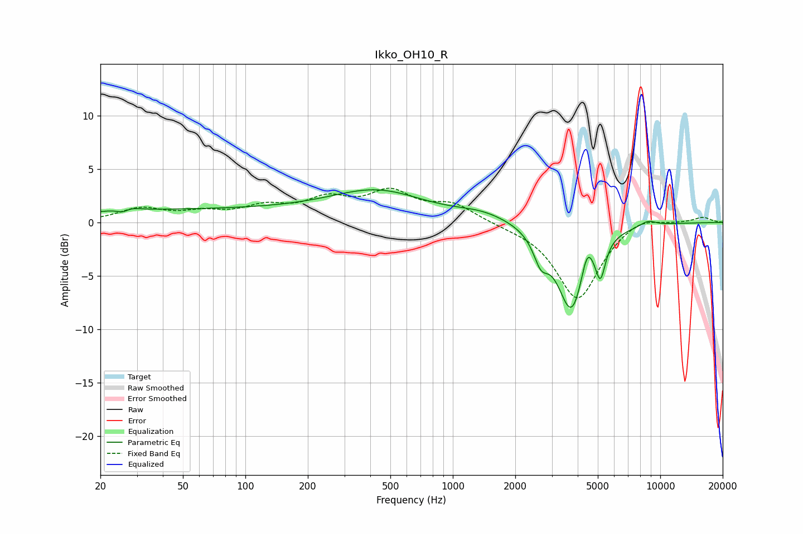

# Ikko_OH10_R
See [usage instructions](https://github.com/jaakkopasanen/AutoEq#usage) for more options and info.

### Parametric EQs
Apply preamp of -3.2 dB when using parametric equalizer.

|   # | Type    |   Fc (Hz) |    Q |   Gain (dB) |
|-----|---------|-----------|------|-------------|
|   1 | Peaking |        26 | 4.26 |        -1   |
|   2 | Peaking |        26 | 3.23 |         1   |
|   3 | Peaking |        61 | 0.18 |         1.2 |
|   4 | Peaking |       440 | 0.63 |         2.6 |
|   5 | Peaking |      1395 | 1.07 |         0.8 |
|   6 | Peaking |      2659 | 4.01 |        -2.3 |
|   7 | Peaking |      3740 | 2.05 |        -8.3 |
|   8 | Peaking |      4437 | 4.89 |         2.5 |
|   9 | Peaking |      5148 | 6    |        -3.2 |
|  10 | Peaking |      8725 | 3.4  |         0.5 |

### Fixed Band EQs
When using fixed band (also called graphic) equalizer, apply preamp of **-3.3 dB** (if available) and set gains manually with these parameters.

|   # | Type    |   Fc (Hz) |    Q |   Gain (dB) |
|-----|---------|-----------|------|-------------|
|   1 | Peaking |        31 | 1.41 |         1.2 |
|   2 | Peaking |        62 | 1.41 |         0.7 |
|   3 | Peaking |       125 | 1.41 |         1.3 |
|   4 | Peaking |       250 | 1.41 |         1.9 |
|   5 | Peaking |       500 | 1.41 |         2.6 |
|   6 | Peaking |      1000 | 1.41 |         1.6 |
|   7 | Peaking |      2000 | 1.41 |        -0.2 |
|   8 | Peaking |      4000 | 1.41 |        -7.2 |
|   9 | Peaking |      8000 | 1.41 |         0.8 |
|  10 | Peaking |     16000 | 1.41 |         0.5 |

### Graphs

