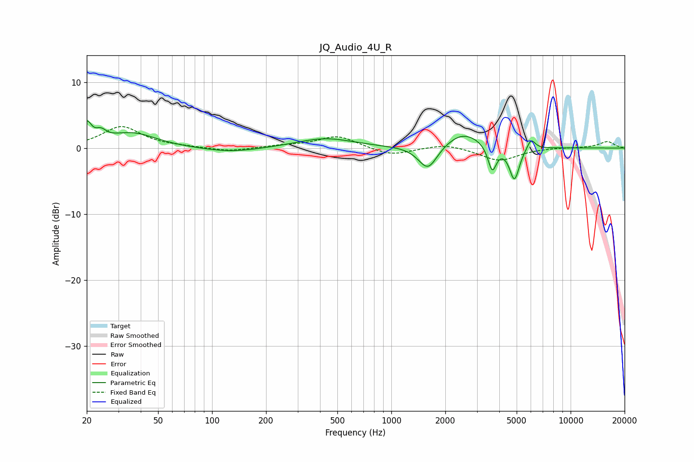

# JQ_Audio_4U_R
See [usage instructions](https://github.com/jaakkopasanen/AutoEq#usage) for more options and info.

### Parametric EQs
Apply preamp of -4.2 dB when using parametric equalizer.

|   # | Type    |   Fc (Hz) |    Q |   Gain (dB) |
|-----|---------|-----------|------|-------------|
|   1 | Peaking |        20 | 5.56 |         3   |
|   2 | Peaking |        24 | 4.74 |         1.3 |
|   3 | Peaking |        36 | 1.07 |         2.2 |
|   4 | Peaking |       127 | 0.88 |        -0.7 |
|   5 | Peaking |       427 | 0.89 |         1.5 |
|   6 | Peaking |      1600 | 2.65 |        -3.8 |
|   7 | Peaking |      2514 | 1.37 |         2.5 |
|   8 | Peaking |      3654 | 6    |        -3.9 |
|   9 | Peaking |      4858 | 5.05 |        -5   |
|  10 | Peaking |      6016 | 6    |         1.7 |

### Fixed Band EQs
When using fixed band (also called graphic) equalizer, apply preamp of **-3.3 dB** (if available) and set gains manually with these parameters.

|   # | Type    |   Fc (Hz) |    Q |   Gain (dB) |
|-----|---------|-----------|------|-------------|
|   1 | Peaking |        31 | 1.41 |         3.2 |
|   2 | Peaking |        62 | 1.41 |         0.1 |
|   3 | Peaking |       125 | 1.41 |        -0.6 |
|   4 | Peaking |       250 | 1.41 |         0.3 |
|   5 | Peaking |       500 | 1.41 |         1.8 |
|   6 | Peaking |      1000 | 1.41 |        -1.2 |
|   7 | Peaking |      2000 | 1.41 |         0.7 |
|   8 | Peaking |      4000 | 1.41 |        -1.9 |
|   9 | Peaking |      8000 | 1.41 |         0.1 |
|  10 | Peaking |     16000 | 1.41 |         1   |

### Graphs

