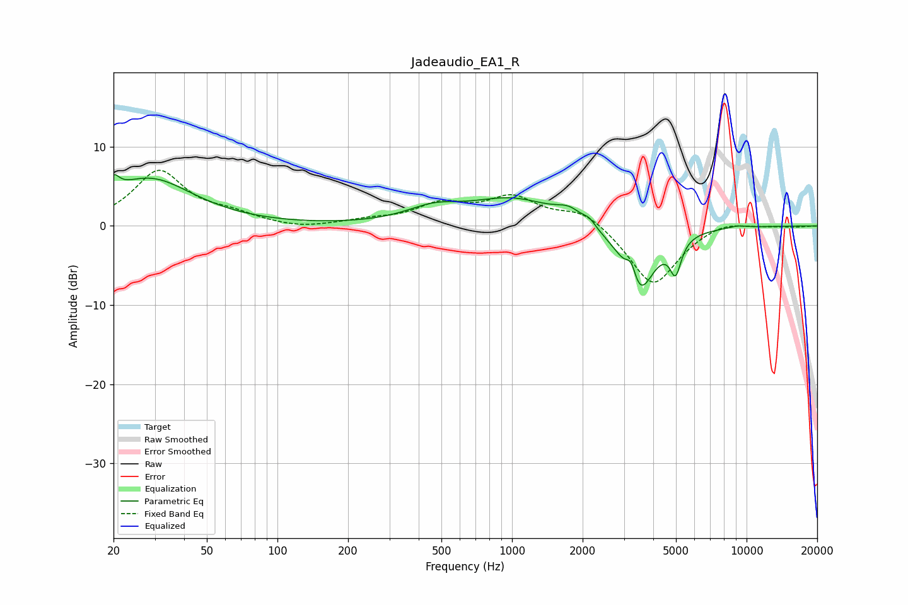

# Jadeaudio_EA1_R
See [usage instructions](https://github.com/jaakkopasanen/AutoEq#usage) for more options and info.

### Parametric EQs
Apply preamp of -6.6 dB when using parametric equalizer.

|   # | Type    |   Fc (Hz) |    Q |   Gain (dB) |
|-----|---------|-----------|------|-------------|
|   1 | Peaking |        20 | 5.99 |         1.9 |
|   2 | Peaking |        28 | 0.76 |         5.9 |
|   3 | Peaking |       461 | 1.2  |         1.7 |
|   4 | Peaking |      1010 | 0.78 |         3.3 |
|   5 | Peaking |      1756 | 2.59 |         1.4 |
|   6 | Peaking |      2135 | 5.73 |         0.7 |
|   7 | Peaking |      3228 | 5.96 |         3.2 |
|   8 | Peaking |      3449 | 2.13 |        -9.3 |
|   9 | Peaking |      4981 | 5.95 |        -4.1 |
|  10 | Peaking |      9159 | 3.43 |         0.3 |

### Fixed Band EQs
When using fixed band (also called graphic) equalizer, apply preamp of **-7.1 dB** (if available) and set gains manually with these parameters.

|   # | Type    |   Fc (Hz) |    Q |   Gain (dB) |
|-----|---------|-----------|------|-------------|
|   1 | Peaking |        31 | 1.41 |         6.8 |
|   2 | Peaking |        62 | 1.41 |         1.2 |
|   3 | Peaking |       125 | 1.41 |        -0.5 |
|   4 | Peaking |       250 | 1.41 |         0.6 |
|   5 | Peaking |       500 | 1.41 |         2.5 |
|   6 | Peaking |      1000 | 1.41 |         3.4 |
|   7 | Peaking |      2000 | 1.41 |         2.1 |
|   8 | Peaking |      4000 | 1.41 |        -7.7 |
|   9 | Peaking |      8000 | 1.41 |         0.9 |
|  10 | Peaking |     16000 | 1.41 |        -0.1 |

### Graphs

