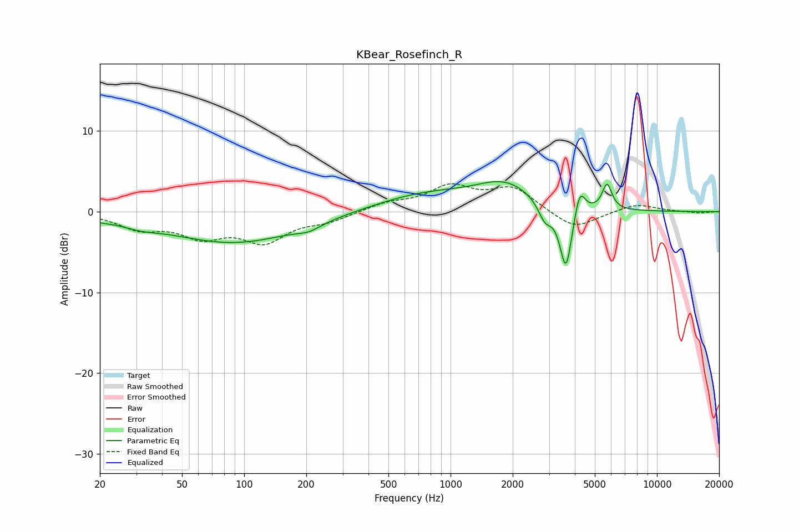

# KBear_Rosefinch_R
See [usage instructions](https://github.com/jaakkopasanen/AutoEq#usage) for more options and info.

### Parametric EQs
Apply preamp of -3.8 dB when using parametric equalizer.

|   # | Type    |   Fc (Hz) |    Q |   Gain (dB) |
|-----|---------|-----------|------|-------------|
|   1 | Peaking |        20 | 2.35 |        -0.3 |
|   2 | Peaking |        31 | 1.58 |        -0.7 |
|   3 | Peaking |        90 | 0.45 |        -3.8 |
|   4 | Peaking |       206 | 2.44 |        -0.7 |
|   5 | Peaking |       756 | 0.57 |         2.1 |
|   6 | Peaking |      1849 | 1    |         3   |
|   7 | Peaking |      2866 | 4.37 |        -2.2 |
|   8 | Peaking |      3623 | 4.71 |        -8.1 |
|   9 | Peaking |      4225 | 5.51 |         3.4 |
|  10 | Peaking |      5731 | 6    |         3.2 |

### Fixed Band EQs
When using fixed band (also called graphic) equalizer, apply preamp of **-3.6 dB** (if available) and set gains manually with these parameters.

|   # | Type    |   Fc (Hz) |    Q |   Gain (dB) |
|-----|---------|-----------|------|-------------|
|   1 | Peaking |        31 | 1.41 |        -1.9 |
|   2 | Peaking |        62 | 1.41 |        -2.7 |
|   3 | Peaking |       125 | 1.41 |        -3.4 |
|   4 | Peaking |       250 | 1.41 |        -1   |
|   5 | Peaking |       500 | 1.41 |         1   |
|   6 | Peaking |      1000 | 1.41 |         2.9 |
|   7 | Peaking |      2000 | 1.41 |         2.8 |
|   8 | Peaking |      4000 | 1.41 |        -2.3 |
|   9 | Peaking |      8000 | 1.41 |         1   |
|  10 | Peaking |     16000 | 1.41 |        -0.2 |

### Graphs

