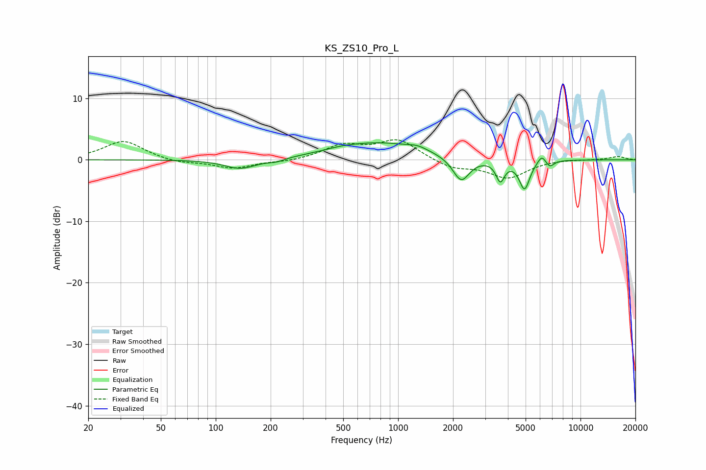

# KS_ZS10_Pro_L
See [usage instructions](https://github.com/jaakkopasanen/AutoEq#usage) for more options and info.

### Parametric EQs
Apply preamp of -2.9 dB when using parametric equalizer.

|   # | Type    |   Fc (Hz) |    Q |   Gain (dB) |
|-----|---------|-----------|------|-------------|
|   1 | Peaking |       137 | 1.61 |        -1.6 |
|   2 | Peaking |       216 | 3.22 |        -0.5 |
|   3 | Peaking |       486 | 1.66 |         0.3 |
|   4 | Peaking |       790 | 0.59 |         2.7 |
|   5 | Peaking |      1280 | 2.73 |         0.6 |
|   6 | Peaking |      2216 | 3.06 |        -4   |
|   7 | Peaking |      3634 | 6    |        -3.2 |
|   8 | Peaking |      4933 | 4.81 |        -4.7 |
|   9 | Peaking |      6133 | 5.99 |         1.4 |
|  10 | Peaking |      6783 | 6    |        -1.1 |

### Fixed Band EQs
When using fixed band (also called graphic) equalizer, apply preamp of **-3.4 dB** (if available) and set gains manually with these parameters.

|   # | Type    |   Fc (Hz) |    Q |   Gain (dB) |
|-----|---------|-----------|------|-------------|
|   1 | Peaking |        31 | 1.41 |         3.1 |
|   2 | Peaking |        62 | 1.41 |        -0.6 |
|   3 | Peaking |       125 | 1.41 |        -1.4 |
|   4 | Peaking |       250 | 1.41 |        -0.3 |
|   5 | Peaking |       500 | 1.41 |         2.2 |
|   6 | Peaking |      1000 | 1.41 |         3.2 |
|   7 | Peaking |      2000 | 1.41 |        -1.4 |
|   8 | Peaking |      4000 | 1.41 |        -2.9 |
|   9 | Peaking |      8000 | 1.41 |         0.1 |
|  10 | Peaking |     16000 | 1.41 |         0.5 |

### Graphs

