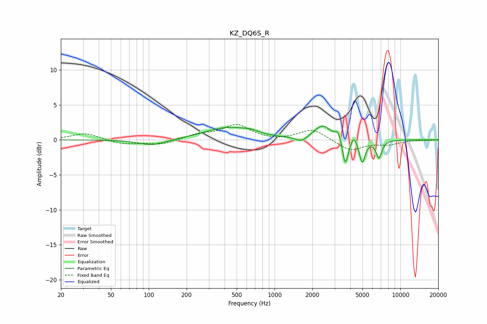

# KZ_DQ6S_R
See [usage instructions](https://github.com/jaakkopasanen/AutoEq#usage) for more options and info.

### Parametric EQs
Apply preamp of -2.0 dB when using parametric equalizer.

|   # | Type    |   Fc (Hz) |    Q |   Gain (dB) |
|-----|---------|-----------|------|-------------|
|   1 | Peaking |       106 | 1.32 |        -0.8 |
|   2 | Peaking |       430 | 0.77 |         1.7 |
|   3 | Peaking |       652 | 2.48 |         0.3 |
|   4 | Peaking |      1634 | 3.18 |        -0.7 |
|   5 | Peaking |      2397 | 2.16 |         2   |
|   6 | Peaking |      3210 | 6    |         1.3 |
|   7 | Peaking |      3646 | 5.99 |        -4   |
|   8 | Peaking |      4277 | 6    |         1.2 |
|   9 | Peaking |      4967 | 5.87 |        -3.3 |
|  10 | Peaking |      6756 | 6    |        -2.5 |

### Fixed Band EQs
When using fixed band (also called graphic) equalizer, apply preamp of **-2.3 dB** (if available) and set gains manually with these parameters.

|   # | Type    |   Fc (Hz) |    Q |   Gain (dB) |
|-----|---------|-----------|------|-------------|
|   1 | Peaking |        31 | 1.41 |         1   |
|   2 | Peaking |        62 | 1.41 |        -0.6 |
|   3 | Peaking |       125 | 1.41 |        -0.7 |
|   4 | Peaking |       250 | 1.41 |         0.7 |
|   5 | Peaking |       500 | 1.41 |         2.1 |
|   6 | Peaking |      1000 | 1.41 |        -0.2 |
|   7 | Peaking |      2000 | 1.41 |         1.6 |
|   8 | Peaking |      4000 | 1.41 |        -1.6 |
|   9 | Peaking |      8000 | 1.41 |        -0.6 |
|  10 | Peaking |     16000 | 1.41 |        -0.1 |

### Graphs

