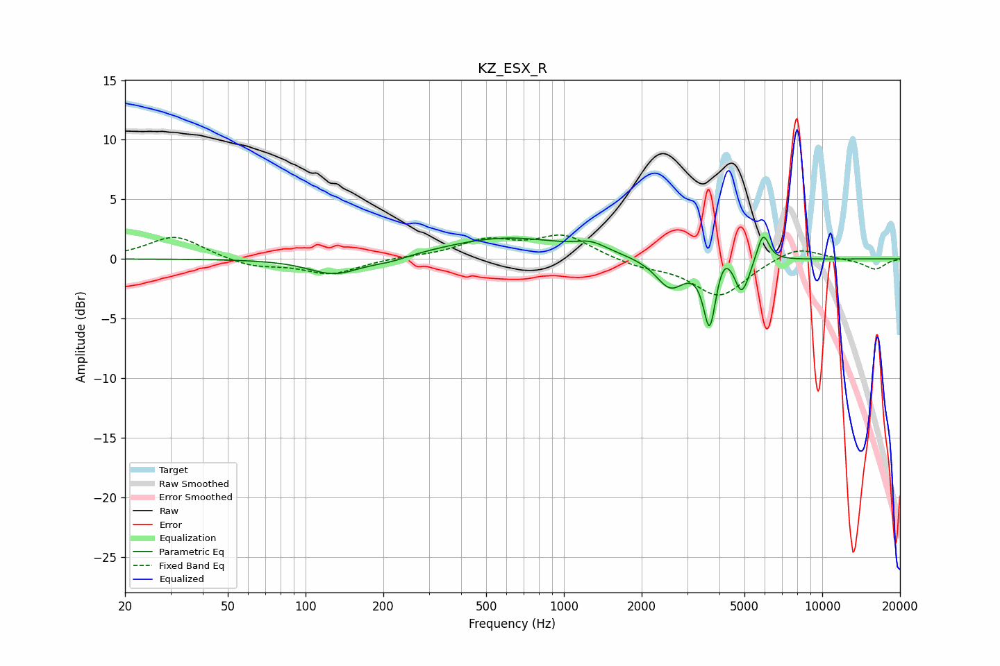

# KZ_ESX_R
See [usage instructions](https://github.com/jaakkopasanen/AutoEq#usage) for more options and info.

### Parametric EQs
Apply preamp of -1.9 dB when using parametric equalizer.

|   # | Type    |   Fc (Hz) |    Q |   Gain (dB) |
|-----|---------|-----------|------|-------------|
|   1 | Peaking |       130 | 1.41 |        -1.4 |
|   2 | Peaking |       213 | 1.94 |        -0.4 |
|   3 | Peaking |       596 | 0.59 |         1.8 |
|   4 | Peaking |      1276 | 2.33 |         0.7 |
|   5 | Peaking |      2580 | 2.52 |        -2.5 |
|   6 | Peaking |      3665 | 6    |        -5.6 |
|   7 | Peaking |      4159 | 4.69 |         1.3 |
|   8 | Peaking |      4828 | 6    |        -2.1 |
|   9 | Peaking |      5090 | 5.9  |        -0.9 |
|  10 | Peaking |      5903 | 6    |         2.4 |

### Fixed Band EQs
When using fixed band (also called graphic) equalizer, apply preamp of **-2.1 dB** (if available) and set gains manually with these parameters.

|   # | Type    |   Fc (Hz) |    Q |   Gain (dB) |
|-----|---------|-----------|------|-------------|
|   1 | Peaking |        31 | 1.41 |         2   |
|   2 | Peaking |        62 | 1.41 |        -0.7 |
|   3 | Peaking |       125 | 1.41 |        -1.3 |
|   4 | Peaking |       250 | 1.41 |         0.1 |
|   5 | Peaking |       500 | 1.41 |         1.5 |
|   6 | Peaking |      1000 | 1.41 |         1.9 |
|   7 | Peaking |      2000 | 1.41 |        -0.6 |
|   8 | Peaking |      4000 | 1.41 |        -3.1 |
|   9 | Peaking |      8000 | 1.41 |         1.1 |
|  10 | Peaking |     16000 | 1.41 |        -0.9 |

### Graphs

