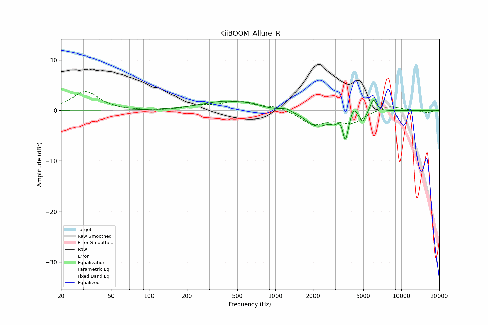

# KiiBOOM_Allure_R
See [usage instructions](https://github.com/jaakkopasanen/AutoEq#usage) for more options and info.

### Parametric EQs
Apply preamp of -2.1 dB when using parametric equalizer.

|   # | Type    |   Fc (Hz) |    Q |   Gain (dB) |
|-----|---------|-----------|------|-------------|
|   1 | Peaking |       409 | 0.73 |         1.8 |
|   2 | Peaking |       637 | 2.68 |         0.4 |
|   3 | Peaking |      1234 | 3.17 |         0.6 |
|   4 | Peaking |      2177 | 1.46 |        -3.1 |
|   5 | Peaking |      2934 | 6    |        -0.8 |
|   6 | Peaking |      3354 | 6    |         0.9 |
|   7 | Peaking |      3598 | 5.98 |        -5.6 |
|   8 | Peaking |      4193 | 6    |         1.8 |
|   9 | Peaking |      4946 | 5.99 |        -2.1 |
|  10 | Peaking |      6020 | 6    |         2.5 |

### Fixed Band EQs
When using fixed band (also called graphic) equalizer, apply preamp of **-3.8 dB** (if available) and set gains manually with these parameters.

|   # | Type    |   Fc (Hz) |    Q |   Gain (dB) |
|-----|---------|-----------|------|-------------|
|   1 | Peaking |        31 | 1.41 |         3.7 |
|   2 | Peaking |        62 | 1.41 |        -0.1 |
|   3 | Peaking |       125 | 1.41 |        -0.1 |
|   4 | Peaking |       250 | 1.41 |         0.8 |
|   5 | Peaking |       500 | 1.41 |         1.7 |
|   6 | Peaking |      1000 | 1.41 |         0.9 |
|   7 | Peaking |      2000 | 1.41 |        -2.6 |
|   8 | Peaking |      4000 | 1.41 |        -2.3 |
|   9 | Peaking |      8000 | 1.41 |         1.1 |
|  10 | Peaking |     16000 | 1.41 |        -0.5 |

### Graphs

