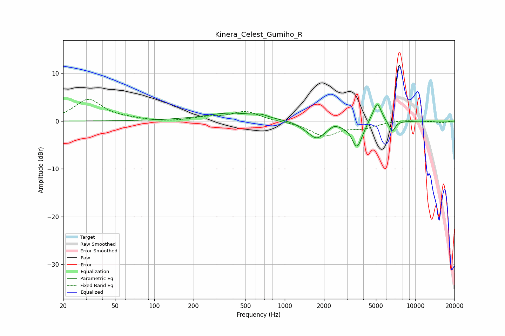

# Kinera_Celest_Gumiho_R
See [usage instructions](https://github.com/jaakkopasanen/AutoEq#usage) for more options and info.

### Parametric EQs
Apply preamp of -3.5 dB when using parametric equalizer.

|   # | Type    |   Fc (Hz) |    Q |   Gain (dB) |
|-----|---------|-----------|------|-------------|
|   1 | Peaking |       232 | 1.35 |        -0.2 |
|   2 | Peaking |       373 | 0.64 |         1.7 |
|   3 | Peaking |       658 | 3.07 |         0.5 |
|   4 | Peaking |      1389 | 2.87 |        -0.3 |
|   5 | Peaking |      1757 | 2.14 |        -3.5 |
|   6 | Peaking |      2393 | 5.46 |         0.5 |
|   7 | Peaking |      3579 | 3.5  |        -5.3 |
|   8 | Peaking |      4593 | 5.46 |         0.5 |
|   9 | Peaking |      5130 | 4.6  |         4.2 |
|  10 | Peaking |      6652 | 5.82 |        -2.3 |

### Fixed Band EQs
When using fixed band (also called graphic) equalizer, apply preamp of **-4.6 dB** (if available) and set gains manually with these parameters.

|   # | Type    |   Fc (Hz) |    Q |   Gain (dB) |
|-----|---------|-----------|------|-------------|
|   1 | Peaking |        31 | 1.41 |         4.5 |
|   2 | Peaking |        62 | 1.41 |         0.3 |
|   3 | Peaking |       125 | 1.41 |        -0.2 |
|   4 | Peaking |       250 | 1.41 |         0.7 |
|   5 | Peaking |       500 | 1.41 |         2   |
|   6 | Peaking |      1000 | 1.41 |        -0.1 |
|   7 | Peaking |      2000 | 1.41 |        -3   |
|   8 | Peaking |      4000 | 1.41 |        -1.2 |
|   9 | Peaking |      8000 | 1.41 |         0.3 |
|  10 | Peaking |     16000 | 1.41 |        -0.3 |

### Graphs

