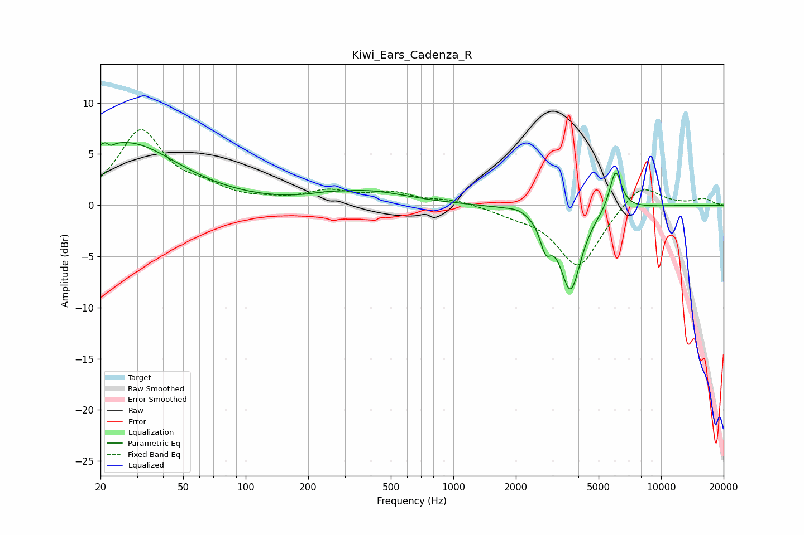

# Kiwi_Ears_Cadenza_R
See [usage instructions](https://github.com/jaakkopasanen/AutoEq#usage) for more options and info.

### Parametric EQs
Apply preamp of -6.2 dB when using parametric equalizer.

|   # | Type    |   Fc (Hz) |    Q |   Gain (dB) |
|-----|---------|-----------|------|-------------|
|   1 | Peaking |        22 | 5.29 |         3.6 |
|   2 | Peaking |        22 | 5.9  |        -3.3 |
|   3 | Peaking |        27 | 0.41 |         1.4 |
|   4 | Peaking |        27 | 0.64 |         4.6 |
|   5 | Peaking |       241 | 1.95 |         0.2 |
|   6 | Peaking |       385 | 0.73 |         1.3 |
|   7 | Peaking |      2035 | 3.53 |         0.3 |
|   8 | Peaking |      2780 | 5.3  |        -2.6 |
|   9 | Peaking |      3665 | 2.74 |        -8.1 |
|  10 | Peaking |      6043 | 4.79 |         4   |

### Fixed Band EQs
When using fixed band (also called graphic) equalizer, apply preamp of **-7.5 dB** (if available) and set gains manually with these parameters.

|   # | Type    |   Fc (Hz) |    Q |   Gain (dB) |
|-----|---------|-----------|------|-------------|
|   1 | Peaking |        31 | 1.41 |         7.1 |
|   2 | Peaking |        62 | 1.41 |         1.2 |
|   3 | Peaking |       125 | 1.41 |         0.3 |
|   4 | Peaking |       250 | 1.41 |         1.2 |
|   5 | Peaking |       500 | 1.41 |         1.1 |
|   6 | Peaking |      1000 | 1.41 |         0.5 |
|   7 | Peaking |      2000 | 1.41 |        -0.6 |
|   8 | Peaking |      4000 | 1.41 |        -6.1 |
|   9 | Peaking |      8000 | 1.41 |         2.3 |
|  10 | Peaking |     16000 | 1.41 |         0.6 |

### Graphs

