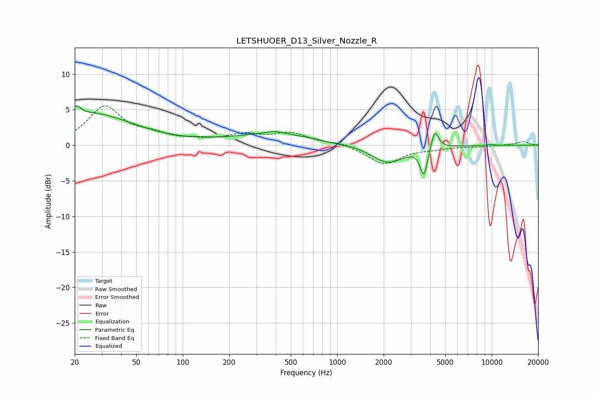

# LETSHUOER_D13_Silver_Nozzle_R
See [usage instructions](https://github.com/jaakkopasanen/AutoEq#usage) for more options and info.

### Parametric EQs
Apply preamp of -5.6 dB when using parametric equalizer.

|   # | Type    |   Fc (Hz) |    Q |   Gain (dB) |
|-----|---------|-----------|------|-------------|
|   1 | Peaking |        21 | 5.63 |         1.2 |
|   2 | Peaking |        25 | 0.5  |         4.4 |
|   3 | Peaking |       395 | 0.49 |         1.5 |
|   4 | Peaking |       396 | 2.37 |         0.4 |
|   5 | Peaking |       860 | 6    |        -0.2 |
|   6 | Peaking |      2124 | 1.34 |        -2.5 |
|   7 | Peaking |      3637 | 6    |        -0.7 |
|   8 | Peaking |      3643 | 6    |        -3.3 |
|   9 | Peaking |      4279 | 5.74 |         2.8 |
|  10 | Peaking |     10000 | 6    |         0.1 |

### Fixed Band EQs
When using fixed band (also called graphic) equalizer, apply preamp of **-5.6 dB** (if available) and set gains manually with these parameters.

|   # | Type    |   Fc (Hz) |    Q |   Gain (dB) |
|-----|---------|-----------|------|-------------|
|   1 | Peaking |        31 | 1.41 |         5.3 |
|   2 | Peaking |        62 | 1.41 |         1.2 |
|   3 | Peaking |       125 | 1.41 |         0.6 |
|   4 | Peaking |       250 | 1.41 |         1.3 |
|   5 | Peaking |       500 | 1.41 |         1.6 |
|   6 | Peaking |      1000 | 1.41 |         0.3 |
|   7 | Peaking |      2000 | 1.41 |        -2.6 |
|   8 | Peaking |      4000 | 1.41 |        -0.4 |
|   9 | Peaking |      8000 | 1.41 |        -0.2 |
|  10 | Peaking |     16000 | 1.41 |         0.5 |

### Graphs

