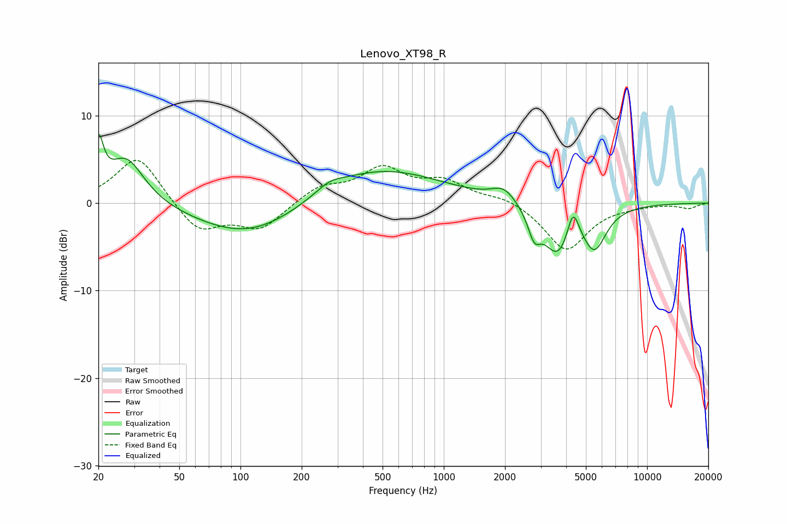

# Lenovo_XT98_R
See [usage instructions](https://github.com/jaakkopasanen/AutoEq#usage) for more options and info.

### Parametric EQs
Apply preamp of -8.0 dB when using parametric equalizer.

|   # | Type    |   Fc (Hz) |    Q |   Gain (dB) |
|-----|---------|-----------|------|-------------|
|   1 | Peaking |        20 | 5.92 |         5.6 |
|   2 | Peaking |        27 | 1.58 |         5.4 |
|   3 | Peaking |       113 | 0.54 |        -4.1 |
|   4 | Peaking |       274 | 2.14 |         0.9 |
|   5 | Peaking |       461 | 0.45 |         4.2 |
|   6 | Peaking |      1979 | 2.32 |         1.7 |
|   7 | Peaking |      2784 | 4.69 |        -2.7 |
|   8 | Peaking |      3641 | 1.91 |        -5.7 |
|   9 | Peaking |      4322 | 4.77 |         3.7 |
|  10 | Peaking |      5516 | 2.42 |        -4.5 |

### Fixed Band EQs
When using fixed band (also called graphic) equalizer, apply preamp of **-5.0 dB** (if available) and set gains manually with these parameters.

|   # | Type    |   Fc (Hz) |    Q |   Gain (dB) |
|-----|---------|-----------|------|-------------|
|   1 | Peaking |        31 | 1.41 |         5.6 |
|   2 | Peaking |        62 | 1.41 |        -3.4 |
|   3 | Peaking |       125 | 1.41 |        -2.9 |
|   4 | Peaking |       250 | 1.41 |         1.8 |
|   5 | Peaking |       500 | 1.41 |         3.7 |
|   6 | Peaking |      1000 | 1.41 |         2.2 |
|   7 | Peaking |      2000 | 1.41 |         0.8 |
|   8 | Peaking |      4000 | 1.41 |        -5.4 |
|   9 | Peaking |      8000 | 1.41 |        -0.2 |
|  10 | Peaking |     16000 | 1.41 |        -0.6 |

### Graphs

