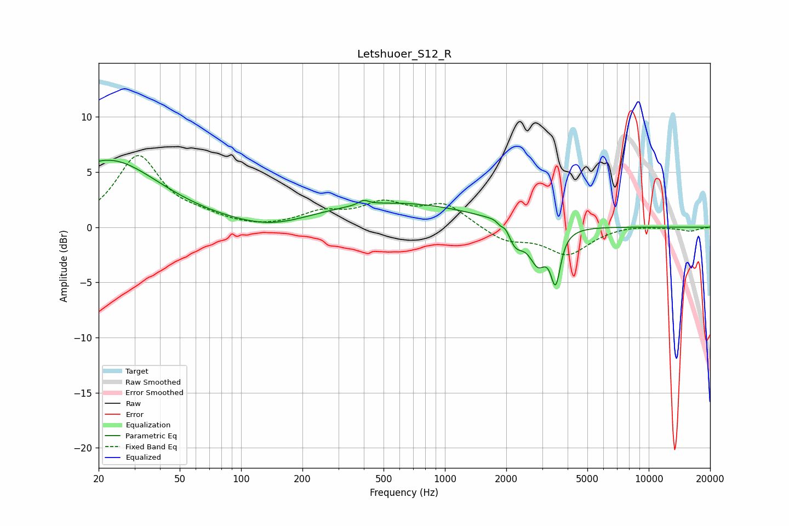

# Letshuoer_S12_R
See [usage instructions](https://github.com/jaakkopasanen/AutoEq#usage) for more options and info.

### Parametric EQs
Apply preamp of -6.2 dB when using parametric equalizer.

|   # | Type    |   Fc (Hz) |    Q |   Gain (dB) |
|-----|---------|-----------|------|-------------|
|   1 | Peaking |        22 | 0.57 |         6.1 |
|   2 | Peaking |       144 | 0.8  |        -0.9 |
|   3 | Peaking |       399 | 5.96 |         0.4 |
|   4 | Peaking |       542 | 0.34 |         2.2 |
|   5 | Peaking |      1888 | 5.98 |        -2   |
|   6 | Peaking |      1913 | 4.54 |         2.7 |
|   7 | Peaking |      2197 | 3.23 |        -2.3 |
|   8 | Peaking |      2863 | 3.31 |        -3.1 |
|   9 | Peaking |      3490 | 6    |        -2.1 |
|  10 | Peaking |      3497 | 6    |        -2.3 |

### Fixed Band EQs
When using fixed band (also called graphic) equalizer, apply preamp of **-6.6 dB** (if available) and set gains manually with these parameters.

|   # | Type    |   Fc (Hz) |    Q |   Gain (dB) |
|-----|---------|-----------|------|-------------|
|   1 | Peaking |        31 | 1.41 |         6.4 |
|   2 | Peaking |        62 | 1.41 |         0.7 |
|   3 | Peaking |       125 | 1.41 |        -0.2 |
|   4 | Peaking |       250 | 1.41 |         1.2 |
|   5 | Peaking |       500 | 1.41 |         1.9 |
|   6 | Peaking |      1000 | 1.41 |         2   |
|   7 | Peaking |      2000 | 1.41 |        -1.2 |
|   8 | Peaking |      4000 | 1.41 |        -2.4 |
|   9 | Peaking |      8000 | 1.41 |         0.2 |
|  10 | Peaking |     16000 | 1.41 |        -0.3 |

### Graphs

