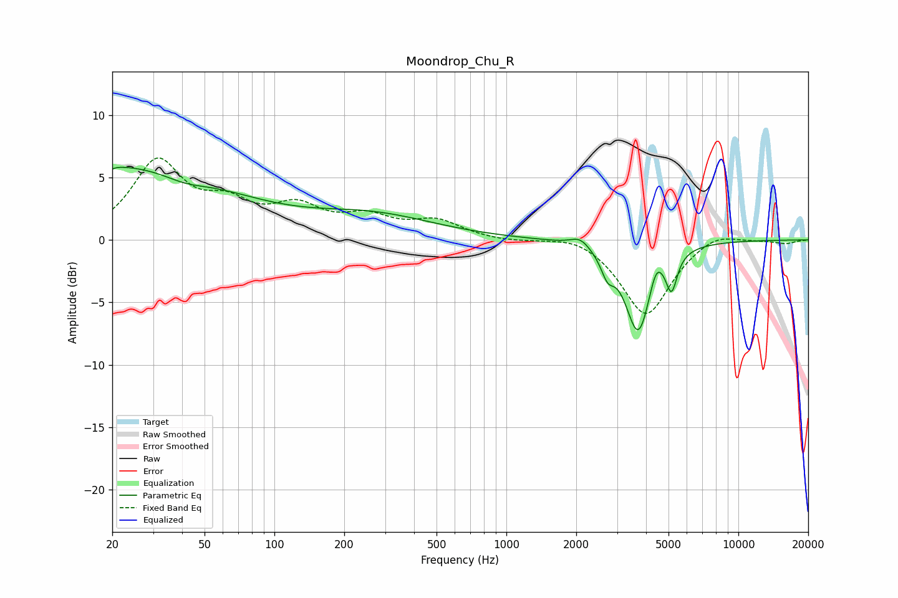

# Moondrop_Chu_R
See [usage instructions](https://github.com/jaakkopasanen/AutoEq#usage) for more options and info.

### Parametric EQs
Apply preamp of -5.9 dB when using parametric equalizer.

|   # | Type    |   Fc (Hz) |    Q |   Gain (dB) |
|-----|---------|-----------|------|-------------|
|   1 | Peaking |        20 | 5.79 |        -3.5 |
|   2 | Peaking |        20 | 5.78 |         3.3 |
|   3 | Peaking |        21 | 0.27 |         6   |
|   4 | Peaking |        41 | 1.46 |        -0.7 |
|   5 | Peaking |       265 | 0.52 |         1.8 |
|   6 | Peaking |      2083 | 3.43 |         0.8 |
|   7 | Peaking |      2730 | 5.04 |        -1.6 |
|   8 | Peaking |      3705 | 2.5  |        -7.4 |
|   9 | Peaking |      4421 | 4.82 |         1.7 |
|  10 | Peaking |      5154 | 5.97 |        -2.8 |

### Fixed Band EQs
When using fixed band (also called graphic) equalizer, apply preamp of **-6.7 dB** (if available) and set gains manually with these parameters.

|   # | Type    |   Fc (Hz) |    Q |   Gain (dB) |
|-----|---------|-----------|------|-------------|
|   1 | Peaking |        31 | 1.41 |         6   |
|   2 | Peaking |        62 | 1.41 |         2.3 |
|   3 | Peaking |       125 | 1.41 |         2.3 |
|   4 | Peaking |       250 | 1.41 |         1.5 |
|   5 | Peaking |       500 | 1.41 |         1.4 |
|   6 | Peaking |      1000 | 1.41 |        -0.2 |
|   7 | Peaking |      2000 | 1.41 |         0.6 |
|   8 | Peaking |      4000 | 1.41 |        -6.1 |
|   9 | Peaking |      8000 | 1.41 |         0.8 |
|  10 | Peaking |     16000 | 1.41 |        -0.3 |

### Graphs

