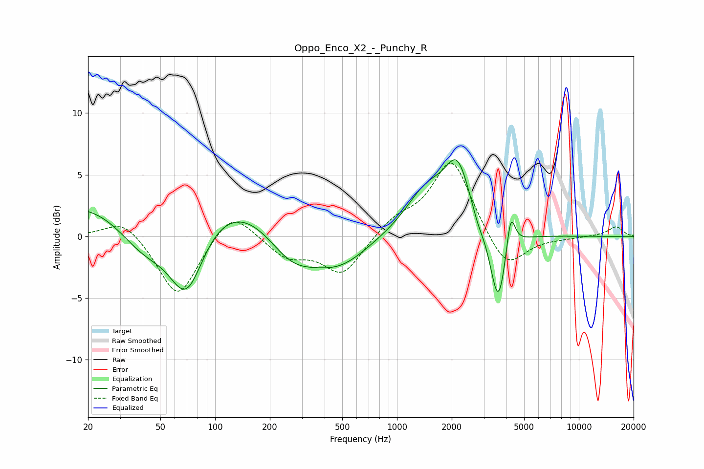

# Oppo_Enco_X2_-_Punchy_R
See [usage instructions](https://github.com/jaakkopasanen/AutoEq#usage) for more options and info.

### Parametric EQs
Apply preamp of -6.3 dB when using parametric equalizer.

|   # | Type    |   Fc (Hz) |    Q |   Gain (dB) |
|-----|---------|-----------|------|-------------|
|   1 | Peaking |        41 | 0.83 |        -4.8 |
|   2 | Peaking |        60 | 0.21 |         5.7 |
|   3 | Peaking |        70 | 1.39 |        -6.9 |
|   4 | Peaking |       263 | 0.94 |        -3.6 |
|   5 | Peaking |       481 | 0.88 |        -2.6 |
|   6 | Peaking |      1462 | 1.2  |         3.5 |
|   7 | Peaking |      2153 | 2.05 |         4.9 |
|   8 | Peaking |      2780 | 5.14 |        -0.6 |
|   9 | Peaking |      3605 | 3.23 |        -6.3 |
|  10 | Peaking |      4220 | 5.91 |         3.3 |

### Fixed Band EQs
When using fixed band (also called graphic) equalizer, apply preamp of **-6.0 dB** (if available) and set gains manually with these parameters.

|   # | Type    |   Fc (Hz) |    Q |   Gain (dB) |
|-----|---------|-----------|------|-------------|
|   1 | Peaking |        31 | 1.41 |         1.6 |
|   2 | Peaking |        62 | 1.41 |        -5.1 |
|   3 | Peaking |       125 | 1.41 |         2.4 |
|   4 | Peaking |       250 | 1.41 |        -1.6 |
|   5 | Peaking |       500 | 1.41 |        -3.1 |
|   6 | Peaking |      1000 | 1.41 |         1.3 |
|   7 | Peaking |      2000 | 1.41 |         6.3 |
|   8 | Peaking |      4000 | 1.41 |        -3   |
|   9 | Peaking |      8000 | 1.41 |        -0.1 |
|  10 | Peaking |     16000 | 1.41 |         0.8 |

### Graphs

