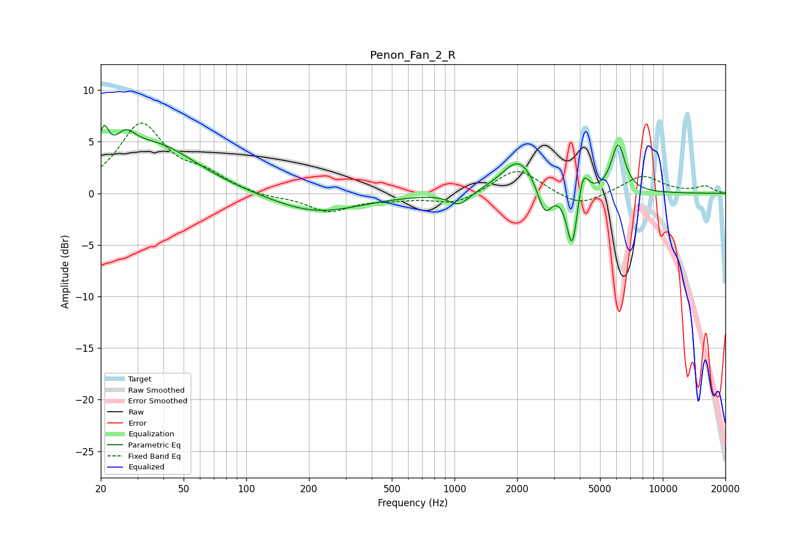

# Penon_Fan_2_R
See [usage instructions](https://github.com/jaakkopasanen/AutoEq#usage) for more options and info.

### Parametric EQs
Apply preamp of -6.7 dB when using parametric equalizer.

|   # | Type    |   Fc (Hz) |    Q |   Gain (dB) |
|-----|---------|-----------|------|-------------|
|   1 | Peaking |        21 | 5.98 |         3.2 |
|   2 | Peaking |        26 | 2.91 |         2.1 |
|   3 | Peaking |        36 | 0.7  |         4.6 |
|   4 | Peaking |       215 | 0.66 |        -1.9 |
|   5 | Peaking |      1054 | 2.93 |        -1.3 |
|   6 | Peaking |      2042 | 1.72 |         3.4 |
|   7 | Peaking |      2711 | 4.13 |        -3   |
|   8 | Peaking |      3677 | 5.52 |        -5.9 |
|   9 | Peaking |      4136 | 5.75 |         2.8 |
|  10 | Peaking |      6113 | 4.17 |         4.7 |

### Fixed Band EQs
When using fixed band (also called graphic) equalizer, apply preamp of **-6.9 dB** (if available) and set gains manually with these parameters.

|   # | Type    |   Fc (Hz) |    Q |   Gain (dB) |
|-----|---------|-----------|------|-------------|
|   1 | Peaking |        31 | 1.41 |         6.6 |
|   2 | Peaking |        62 | 1.41 |         1.5 |
|   3 | Peaking |       125 | 1.41 |        -0.4 |
|   4 | Peaking |       250 | 1.41 |        -1.7 |
|   5 | Peaking |       500 | 1.41 |        -0.4 |
|   6 | Peaking |      1000 | 1.41 |        -1.1 |
|   7 | Peaking |      2000 | 1.41 |         2.5 |
|   8 | Peaking |      4000 | 1.41 |        -1.4 |
|   9 | Peaking |      8000 | 1.41 |         1.7 |
|  10 | Peaking |     16000 | 1.41 |         0.7 |

### Graphs

