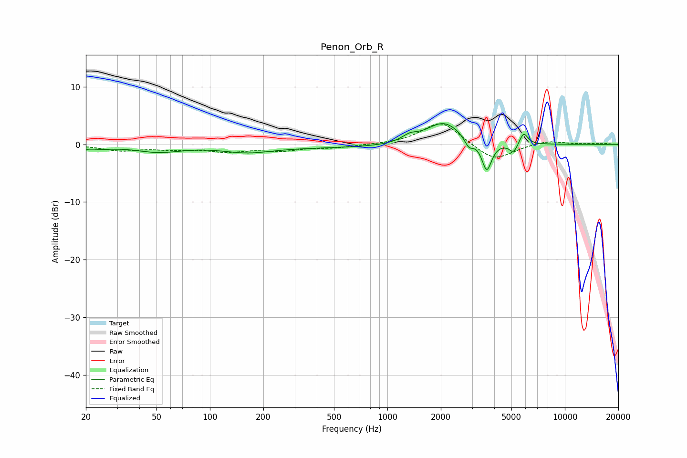

# Penon_Orb_R
See [usage instructions](https://github.com/jaakkopasanen/AutoEq#usage) for more options and info.

### Parametric EQs
Apply preamp of -3.7 dB when using parametric equalizer.

|   # | Type    |   Fc (Hz) |    Q |   Gain (dB) |
|-----|---------|-----------|------|-------------|
|   1 | Peaking |        21 | 1.44 |        -0.7 |
|   2 | Peaking |        51 | 1.14 |        -1.2 |
|   3 | Peaking |       162 | 1.06 |        -1   |
|   4 | Peaking |       572 | 0.23 |        -0.6 |
|   5 | Peaking |      1337 | 3.2  |         1   |
|   6 | Peaking |      2076 | 1.41 |         4.1 |
|   7 | Peaking |      2879 | 5.74 |        -1.7 |
|   8 | Peaking |      3630 | 5.16 |        -5.1 |
|   9 | Peaking |      5141 | 6    |        -1.7 |
|  10 | Peaking |      5852 | 6    |         2.1 |

### Fixed Band EQs
When using fixed band (also called graphic) equalizer, apply preamp of **-3.7 dB** (if available) and set gains manually with these parameters.

|   # | Type    |   Fc (Hz) |    Q |   Gain (dB) |
|-----|---------|-----------|------|-------------|
|   1 | Peaking |        31 | 1.41 |        -1   |
|   2 | Peaking |        62 | 1.41 |        -0.7 |
|   3 | Peaking |       125 | 1.41 |        -1.1 |
|   4 | Peaking |       250 | 1.41 |        -0.9 |
|   5 | Peaking |       500 | 1.41 |        -0.5 |
|   6 | Peaking |      1000 | 1.41 |        -0   |
|   7 | Peaking |      2000 | 1.41 |         4.1 |
|   8 | Peaking |      4000 | 1.41 |        -3   |
|   9 | Peaking |      8000 | 1.41 |         0.7 |
|  10 | Peaking |     16000 | 1.41 |         0.2 |

### Graphs

