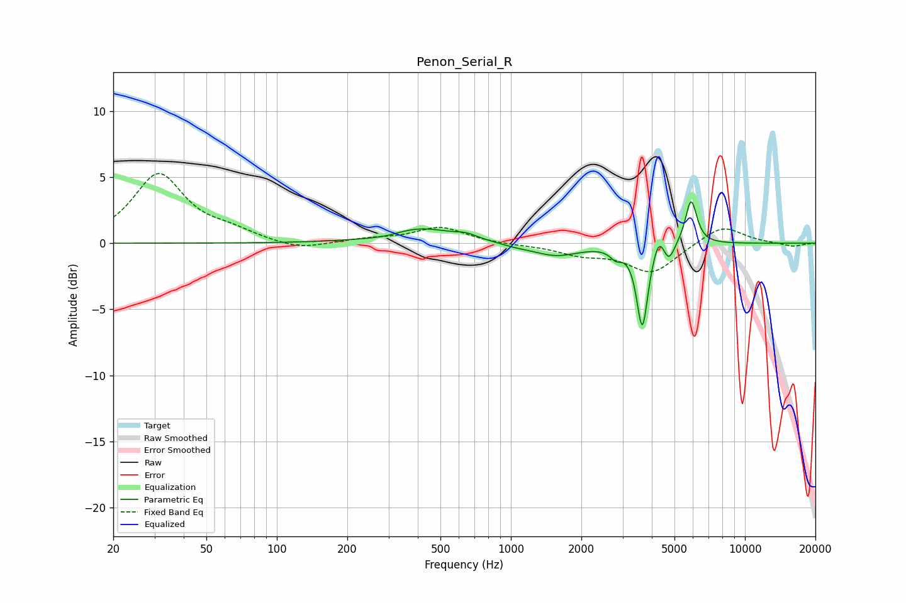

# Penon_Serial_R
See [usage instructions](https://github.com/jaakkopasanen/AutoEq#usage) for more options and info.

### Parametric EQs
Apply preamp of -3.3 dB when using parametric equalizer.

|   # | Type    |   Fc (Hz) |    Q |   Gain (dB) |
|-----|---------|-----------|------|-------------|
|   1 | Peaking |       294 | 1.65 |        -0.3 |
|   2 | Peaking |       403 | 0.99 |         1.2 |
|   3 | Peaking |       645 | 2.99 |         0.3 |
|   4 | Peaking |      1049 | 2.2  |        -0.2 |
|   5 | Peaking |      1557 | 1.41 |        -0.9 |
|   6 | Peaking |      2810 | 5.72 |        -0.7 |
|   7 | Peaking |      3643 | 6    |        -6.3 |
|   8 | Peaking |      4290 | 6    |         1.4 |
|   9 | Peaking |      4733 | 6    |        -1.3 |
|  10 | Peaking |      5888 | 5.72 |         3.4 |

### Fixed Band EQs
When using fixed band (also called graphic) equalizer, apply preamp of **-5.4 dB** (if available) and set gains manually with these parameters.

|   # | Type    |   Fc (Hz) |    Q |   Gain (dB) |
|-----|---------|-----------|------|-------------|
|   1 | Peaking |        31 | 1.41 |         5.2 |
|   2 | Peaking |        62 | 1.41 |         0.7 |
|   3 | Peaking |       125 | 1.41 |        -0.6 |
|   4 | Peaking |       250 | 1.41 |         0.3 |
|   5 | Peaking |       500 | 1.41 |         1.2 |
|   6 | Peaking |      1000 | 1.41 |        -0.1 |
|   7 | Peaking |      2000 | 1.41 |        -0.7 |
|   8 | Peaking |      4000 | 1.41 |        -2.2 |
|   9 | Peaking |      8000 | 1.41 |         1.4 |
|  10 | Peaking |     16000 | 1.41 |        -0.3 |

### Graphs

