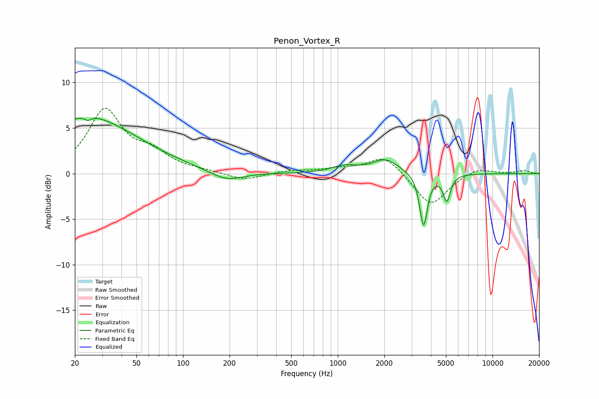

# Penon_Vortex_R
See [usage instructions](https://github.com/jaakkopasanen/AutoEq#usage) for more options and info.

### Parametric EQs
Apply preamp of -6.2 dB when using parametric equalizer.

|   # | Type    |   Fc (Hz) |    Q |   Gain (dB) |
|-----|---------|-----------|------|-------------|
|   1 | Peaking |        22 | 1.02 |         1.8 |
|   2 | Peaking |        25 | 5.45 |        -4   |
|   3 | Peaking |        25 | 5.44 |         3.4 |
|   4 | Peaking |        29 | 0.44 |         4.8 |
|   5 | Peaking |        67 | 1.88 |        -0   |
|   6 | Peaking |       190 | 1.34 |        -1.1 |
|   7 | Peaking |      1102 | 1.75 |         0.7 |
|   8 | Peaking |      2032 | 1.68 |         1.5 |
|   9 | Peaking |      3585 | 5.63 |        -5.8 |
|  10 | Peaking |      5059 | 6    |        -2.9 |

### Fixed Band EQs
When using fixed band (also called graphic) equalizer, apply preamp of **-7.3 dB** (if available) and set gains manually with these parameters.

|   # | Type    |   Fc (Hz) |    Q |   Gain (dB) |
|-----|---------|-----------|------|-------------|
|   1 | Peaking |        31 | 1.41 |         6.8 |
|   2 | Peaking |        62 | 1.41 |         1.9 |
|   3 | Peaking |       125 | 1.41 |         0.2 |
|   4 | Peaking |       250 | 1.41 |        -0.8 |
|   5 | Peaking |       500 | 1.41 |         0.3 |
|   6 | Peaking |      1000 | 1.41 |         0.4 |
|   7 | Peaking |      2000 | 1.41 |         2   |
|   8 | Peaking |      4000 | 1.41 |        -3.6 |
|   9 | Peaking |      8000 | 1.41 |         0.7 |
|  10 | Peaking |     16000 | 1.41 |         0.3 |

### Graphs

