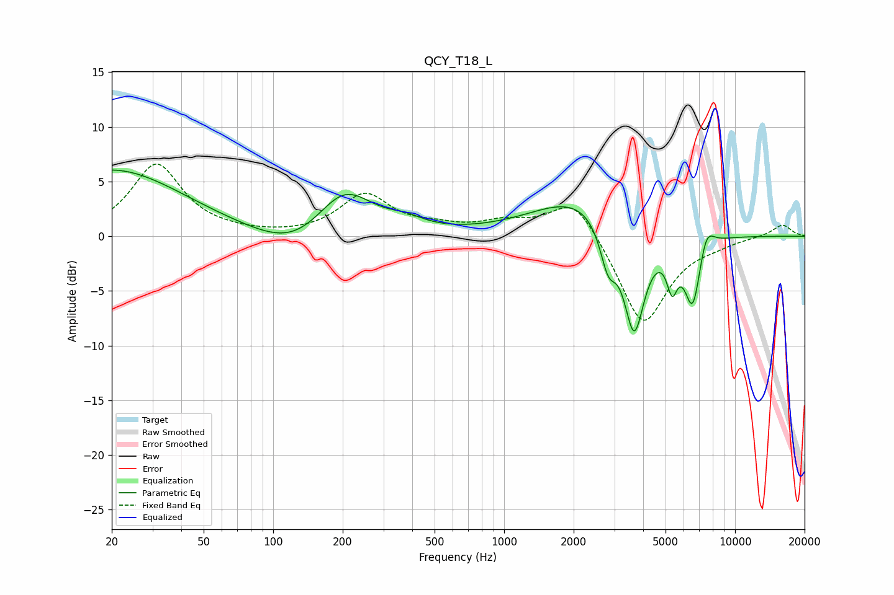

# QCY_T18_L
See [usage instructions](https://github.com/jaakkopasanen/AutoEq#usage) for more options and info.

### Parametric EQs
Apply preamp of -6.1 dB when using parametric equalizer.

|   # | Type    |   Fc (Hz) |    Q |   Gain (dB) |
|-----|---------|-----------|------|-------------|
|   1 | Peaking |        20 | 0.45 |         6.1 |
|   2 | Peaking |       126 | 0.84 |        -2.3 |
|   3 | Peaking |       203 | 1.12 |         4.6 |
|   4 | Peaking |       376 | 1.78 |         0.8 |
|   5 | Peaking |      2152 | 0.7  |         3.7 |
|   6 | Peaking |      2820 | 3.99 |        -3.8 |
|   7 | Peaking |      3655 | 2.95 |        -9.9 |
|   8 | Peaking |      5339 | 5.91 |        -3.5 |
|   9 | Peaking |      6559 | 3.73 |        -6.5 |
|  10 | Peaking |      7490 | 4.11 |         2.3 |

### Fixed Band EQs
When using fixed band (also called graphic) equalizer, apply preamp of **-6.7 dB** (if available) and set gains manually with these parameters.

|   # | Type    |   Fc (Hz) |    Q |   Gain (dB) |
|-----|---------|-----------|------|-------------|
|   1 | Peaking |        31 | 1.41 |         6.5 |
|   2 | Peaking |        62 | 1.41 |         0.2 |
|   3 | Peaking |       125 | 1.41 |        -0   |
|   4 | Peaking |       250 | 1.41 |         3.7 |
|   5 | Peaking |       500 | 1.41 |         0.6 |
|   6 | Peaking |      1000 | 1.41 |         1.1 |
|   7 | Peaking |      2000 | 1.41 |         3.8 |
|   8 | Peaking |      4000 | 1.41 |        -8.3 |
|   9 | Peaking |      8000 | 1.41 |        -0.4 |
|  10 | Peaking |     16000 | 1.41 |         1.1 |

### Graphs

