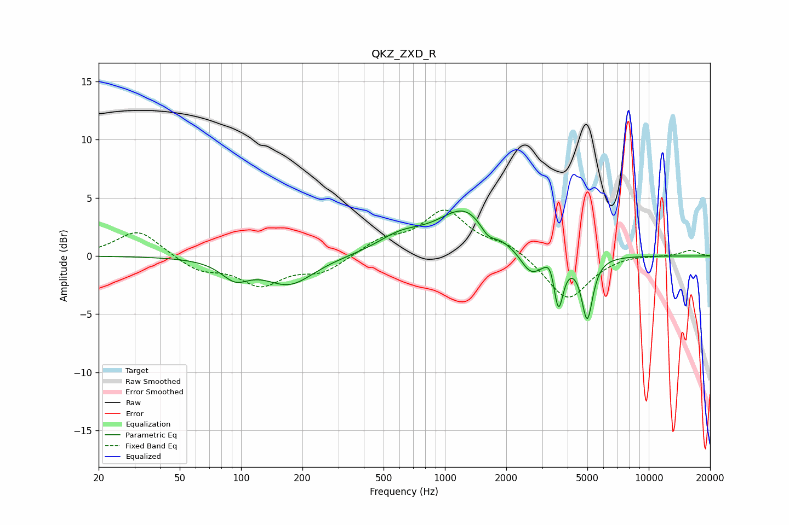

# QKZ_ZXD_R
See [usage instructions](https://github.com/jaakkopasanen/AutoEq#usage) for more options and info.

### Parametric EQs
Apply preamp of -4.0 dB when using parametric equalizer.

|   # | Type    |   Fc (Hz) |    Q |   Gain (dB) |
|-----|---------|-----------|------|-------------|
|   1 | Peaking |        93 | 2.08 |        -1.6 |
|   2 | Peaking |       172 | 1.17 |        -2.4 |
|   3 | Peaking |       553 | 1.82 |         0.1 |
|   4 | Peaking |       620 | 1.18 |         1.3 |
|   5 | Peaking |      1266 | 1.06 |         3.9 |
|   6 | Peaking |      1623 | 3.53 |        -1.1 |
|   7 | Peaking |      2641 | 2.65 |        -2   |
|   8 | Peaking |      3300 | 6    |         1.1 |
|   9 | Peaking |      3602 | 6    |        -4.4 |
|  10 | Peaking |      4990 | 5.14 |        -5.3 |

### Fixed Band EQs
When using fixed band (also called graphic) equalizer, apply preamp of **-4.0 dB** (if available) and set gains manually with these parameters.

|   # | Type    |   Fc (Hz) |    Q |   Gain (dB) |
|-----|---------|-----------|------|-------------|
|   1 | Peaking |        31 | 1.41 |         2.3 |
|   2 | Peaking |        62 | 1.41 |        -1.2 |
|   3 | Peaking |       125 | 1.41 |        -2.3 |
|   4 | Peaking |       250 | 1.41 |        -1.3 |
|   5 | Peaking |       500 | 1.41 |         1.3 |
|   6 | Peaking |      1000 | 1.41 |         3.7 |
|   7 | Peaking |      2000 | 1.41 |         1   |
|   8 | Peaking |      4000 | 1.41 |        -3.9 |
|   9 | Peaking |      8000 | 1.41 |         0.2 |
|  10 | Peaking |     16000 | 1.41 |         0.5 |

### Graphs

