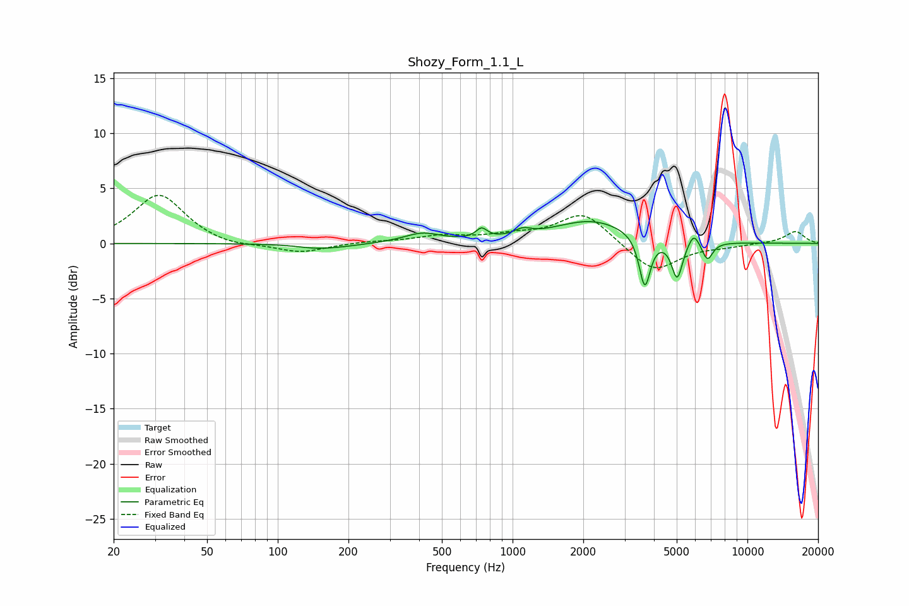

# Shozy_Form_1.1_L
See [usage instructions](https://github.com/jaakkopasanen/AutoEq#usage) for more options and info.

### Parametric EQs
Apply preamp of -2.1 dB when using parametric equalizer.

|   # | Type    |   Fc (Hz) |    Q |   Gain (dB) |
|-----|---------|-----------|------|-------------|
|   1 | Peaking |       142 | 2.24 |        -0.1 |
|   2 | Peaking |       168 | 1.24 |        -0.4 |
|   3 | Peaking |       412 | 1.82 |         0.9 |
|   4 | Peaking |       738 | 6    |         0.9 |
|   5 | Peaking |      1105 | 3.95 |         0.6 |
|   6 | Peaking |      2175 | 0.86 |         2.1 |
|   7 | Peaking |      3656 | 6    |        -4.7 |
|   8 | Peaking |      5020 | 5.99 |        -3.5 |
|   9 | Peaking |      5910 | 6    |         1.2 |
|  10 | Peaking |      6754 | 5.99 |        -1.7 |

### Fixed Band EQs
When using fixed band (also called graphic) equalizer, apply preamp of **-4.5 dB** (if available) and set gains manually with these parameters.

|   # | Type    |   Fc (Hz) |    Q |   Gain (dB) |
|-----|---------|-----------|------|-------------|
|   1 | Peaking |        31 | 1.41 |         4.5 |
|   2 | Peaking |        62 | 1.41 |        -0.4 |
|   3 | Peaking |       125 | 1.41 |        -0.9 |
|   4 | Peaking |       250 | 1.41 |         0.2 |
|   5 | Peaking |       500 | 1.41 |         0.6 |
|   6 | Peaking |      1000 | 1.41 |         0.6 |
|   7 | Peaking |      2000 | 1.41 |         2.8 |
|   8 | Peaking |      4000 | 1.41 |        -2.7 |
|   9 | Peaking |      8000 | 1.41 |        -0.2 |
|  10 | Peaking |     16000 | 1.41 |         1.1 |

### Graphs

