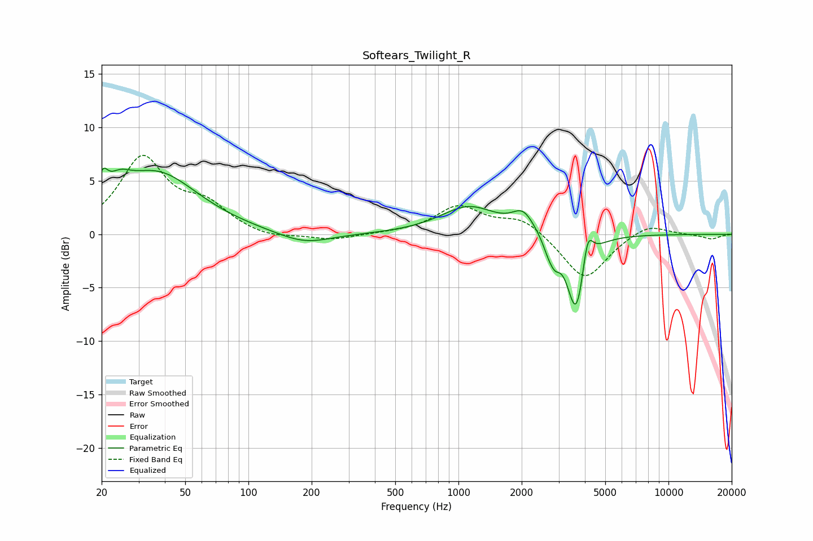

# Softears_Twilight_R
See [usage instructions](https://github.com/jaakkopasanen/AutoEq#usage) for more options and info.

### Parametric EQs
Apply preamp of -6.3 dB when using parametric equalizer.

|   # | Type    |   Fc (Hz) |    Q |   Gain (dB) |
|-----|---------|-----------|------|-------------|
|   1 | Peaking |        20 | 5.99 |         2.1 |
|   2 | Peaking |        24 | 2.58 |         1.6 |
|   3 | Peaking |        37 | 0.72 |         5.6 |
|   4 | Peaking |       185 | 1.11 |        -1.1 |
|   5 | Peaking |      1120 | 1.06 |         2.6 |
|   6 | Peaking |      2034 | 2.76 |         1.8 |
|   7 | Peaking |      2693 | 4.97 |        -1.2 |
|   8 | Peaking |      2888 | 6    |        -1.3 |
|   9 | Peaking |      3641 | 3.25 |        -7.7 |
|  10 | Peaking |      4116 | 5.7  |         3.3 |

### Fixed Band EQs
When using fixed band (also called graphic) equalizer, apply preamp of **-7.5 dB** (if available) and set gains manually with these parameters.

|   # | Type    |   Fc (Hz) |    Q |   Gain (dB) |
|-----|---------|-----------|------|-------------|
|   1 | Peaking |        31 | 1.41 |         7   |
|   2 | Peaking |        62 | 1.41 |         2.3 |
|   3 | Peaking |       125 | 1.41 |        -0.5 |
|   4 | Peaking |       250 | 1.41 |        -0.6 |
|   5 | Peaking |       500 | 1.41 |         0.1 |
|   6 | Peaking |      1000 | 1.41 |         2.5 |
|   7 | Peaking |      2000 | 1.41 |         1.5 |
|   8 | Peaking |      4000 | 1.41 |        -4.4 |
|   9 | Peaking |      8000 | 1.41 |         1.1 |
|  10 | Peaking |     16000 | 1.41 |        -0.4 |

### Graphs

