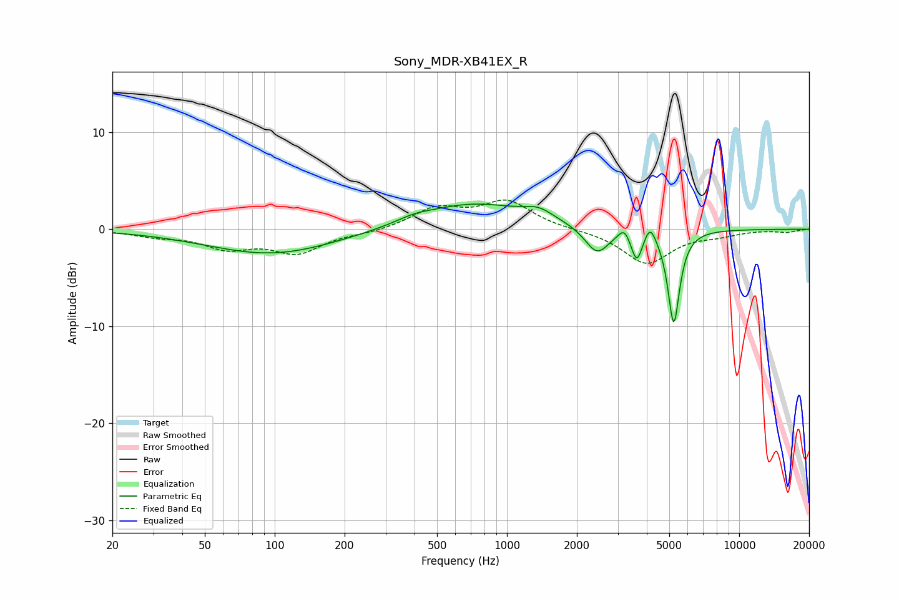

# Sony_MDR-XB41EX_R
See [usage instructions](https://github.com/jaakkopasanen/AutoEq#usage) for more options and info.

### Parametric EQs
Apply preamp of -2.7 dB when using parametric equalizer.

|   # | Type    |   Fc (Hz) |    Q |   Gain (dB) |
|-----|---------|-----------|------|-------------|
|   1 | Peaking |        97 | 0.51 |        -2.6 |
|   2 | Peaking |       397 | 1.94 |         0.4 |
|   3 | Peaking |       711 | 0.62 |         2.6 |
|   4 | Peaking |      1368 | 2.14 |         1   |
|   5 | Peaking |      2443 | 2.73 |        -2.8 |
|   6 | Peaking |      3199 | 6    |         1.1 |
|   7 | Peaking |      3620 | 6    |        -2.3 |
|   8 | Peaking |      3631 | 6    |        -0.8 |
|   9 | Peaking |      4137 | 6    |         1.7 |
|  10 | Peaking |      5228 | 5.55 |        -9.7 |

### Fixed Band EQs
When using fixed band (also called graphic) equalizer, apply preamp of **-3.1 dB** (if available) and set gains manually with these parameters.

|   # | Type    |   Fc (Hz) |    Q |   Gain (dB) |
|-----|---------|-----------|------|-------------|
|   1 | Peaking |        31 | 1.41 |        -0.6 |
|   2 | Peaking |        62 | 1.41 |        -1.7 |
|   3 | Peaking |       125 | 1.41 |        -2.3 |
|   4 | Peaking |       250 | 1.41 |        -0.3 |
|   5 | Peaking |       500 | 1.41 |         2.1 |
|   6 | Peaking |      1000 | 1.41 |         2.8 |
|   7 | Peaking |      2000 | 1.41 |        -0   |
|   8 | Peaking |      4000 | 1.41 |        -3.5 |
|   9 | Peaking |      8000 | 1.41 |        -0.5 |
|  10 | Peaking |     16000 | 1.41 |        -0.3 |

### Graphs

