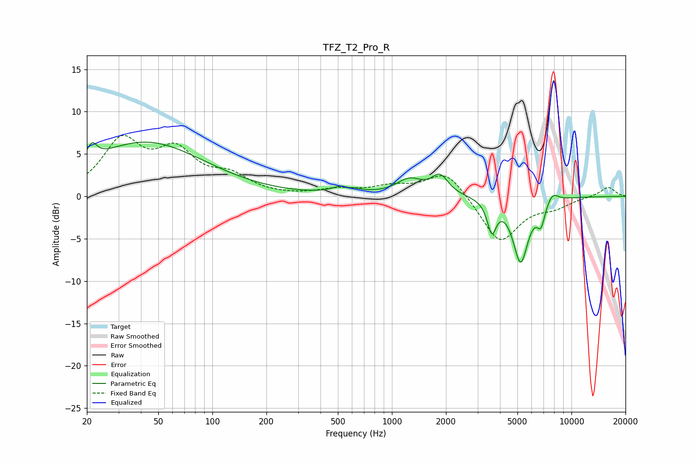

# TFZ_T2_Pro_R
See [usage instructions](https://github.com/jaakkopasanen/AutoEq#usage) for more options and info.

### Parametric EQs
Apply preamp of -6.5 dB when using parametric equalizer.

|   # | Type    |   Fc (Hz) |    Q |   Gain (dB) |
|-----|---------|-----------|------|-------------|
|   1 | Peaking |        21 | 5.23 |         1.9 |
|   2 | Peaking |        42 | 0.43 |         6.4 |
|   3 | Peaking |       553 | 2.53 |         1.2 |
|   4 | Peaking |       569 | 5.09 |        -0.5 |
|   5 | Peaking |      1253 | 1.94 |         1.8 |
|   6 | Peaking |      1853 | 3.06 |         2.2 |
|   7 | Peaking |      3603 | 5.74 |        -3.6 |
|   8 | Peaking |      5212 | 3.24 |        -7.6 |
|   9 | Peaking |      6767 | 5.96 |        -2.4 |
|  10 | Peaking |      7821 | 4.06 |         1.2 |

### Fixed Band EQs
When using fixed band (also called graphic) equalizer, apply preamp of **-7.3 dB** (if available) and set gains manually with these parameters.

|   # | Type    |   Fc (Hz) |    Q |   Gain (dB) |
|-----|---------|-----------|------|-------------|
|   1 | Peaking |        31 | 1.41 |         6.2 |
|   2 | Peaking |        62 | 1.41 |         4.7 |
|   3 | Peaking |       125 | 1.41 |         2   |
|   4 | Peaking |       250 | 1.41 |        -0   |
|   5 | Peaking |       500 | 1.41 |         0.7 |
|   6 | Peaking |      1000 | 1.41 |         1   |
|   7 | Peaking |      2000 | 1.41 |         3.1 |
|   8 | Peaking |      4000 | 1.41 |        -5.5 |
|   9 | Peaking |      8000 | 1.41 |        -1   |
|  10 | Peaking |     16000 | 1.41 |         1.1 |

### Graphs

