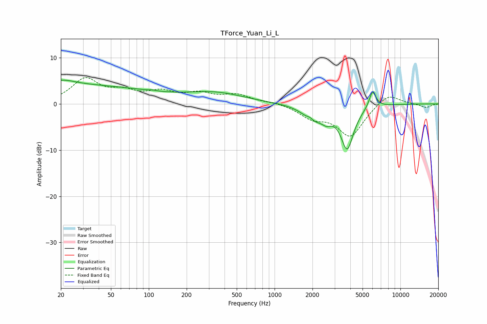

# TForce_Yuan_Li_L
See [usage instructions](https://github.com/jaakkopasanen/AutoEq#usage) for more options and info.

### Parametric EQs
Apply preamp of -5.2 dB when using parametric equalizer.

|   # | Type    |   Fc (Hz) |    Q |   Gain (dB) |
|-----|---------|-----------|------|-------------|
|   1 | Peaking |        21 | 1.41 |         1.1 |
|   2 | Peaking |        22 | 0.18 |         4   |
|   3 | Peaking |       106 | 5.65 |         0.1 |
|   4 | Peaking |       340 | 0.62 |         2.2 |
|   5 | Peaking |      1915 | 5.88 |         1.6 |
|   6 | Peaking |      1915 | 5.6  |        -1   |
|   7 | Peaking |      2034 | 1.72 |        -3   |
|   8 | Peaking |      2596 | 3.75 |        -1.6 |
|   9 | Peaking |      3773 | 2.73 |        -9.3 |
|  10 | Peaking |      6005 | 4.97 |         3.7 |

### Fixed Band EQs
When using fixed band (also called graphic) equalizer, apply preamp of **-5.8 dB** (if available) and set gains manually with these parameters.

|   # | Type    |   Fc (Hz) |    Q |   Gain (dB) |
|-----|---------|-----------|------|-------------|
|   1 | Peaking |        31 | 1.41 |         5.2 |
|   2 | Peaking |        62 | 1.41 |         2.1 |
|   3 | Peaking |       125 | 1.41 |         2.2 |
|   4 | Peaking |       250 | 1.41 |         1.9 |
|   5 | Peaking |       500 | 1.41 |         1.8 |
|   6 | Peaking |      1000 | 1.41 |         0.4 |
|   7 | Peaking |      2000 | 1.41 |        -2.6 |
|   8 | Peaking |      4000 | 1.41 |        -6.9 |
|   9 | Peaking |      8000 | 1.41 |         2.5 |
|  10 | Peaking |     16000 | 1.41 |        -0.8 |

### Graphs

