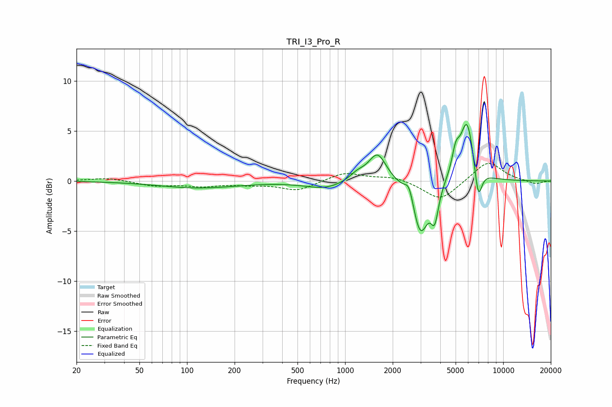

# TRI_I3_Pro_R
See [usage instructions](https://github.com/jaakkopasanen/AutoEq#usage) for more options and info.

### Parametric EQs
Apply preamp of -5.7 dB when using parametric equalizer.

|   # | Type    |   Fc (Hz) |    Q |   Gain (dB) |
|-----|---------|-----------|------|-------------|
|   1 | Peaking |       118 | 0.56 |        -0.7 |
|   2 | Peaking |       749 | 1.12 |        -0.8 |
|   3 | Peaking |      1196 | 2.7  |         0.7 |
|   4 | Peaking |      1604 | 2.54 |         2.8 |
|   5 | Peaking |      2542 | 5.37 |         1.6 |
|   6 | Peaking |      2995 | 2.85 |        -5.4 |
|   7 | Peaking |      3689 | 5.91 |        -3   |
|   8 | Peaking |      5010 | 5.94 |         2.1 |
|   9 | Peaking |      5904 | 3.16 |         6.1 |
|  10 | Peaking |      6952 | 5.8  |        -3.4 |

### Fixed Band EQs
When using fixed band (also called graphic) equalizer, apply preamp of **-1.9 dB** (if available) and set gains manually with these parameters.

|   # | Type    |   Fc (Hz) |    Q |   Gain (dB) |
|-----|---------|-----------|------|-------------|
|   1 | Peaking |        31 | 1.41 |         0.3 |
|   2 | Peaking |        62 | 1.41 |        -0.5 |
|   3 | Peaking |       125 | 1.41 |        -0.5 |
|   4 | Peaking |       250 | 1.41 |        -0.3 |
|   5 | Peaking |       500 | 1.41 |        -0.9 |
|   6 | Peaking |      1000 | 1.41 |         0.9 |
|   7 | Peaking |      2000 | 1.41 |         0.5 |
|   8 | Peaking |      4000 | 1.41 |        -2   |
|   9 | Peaking |      8000 | 1.41 |         2   |
|  10 | Peaking |     16000 | 1.41 |        -0.3 |

### Graphs

