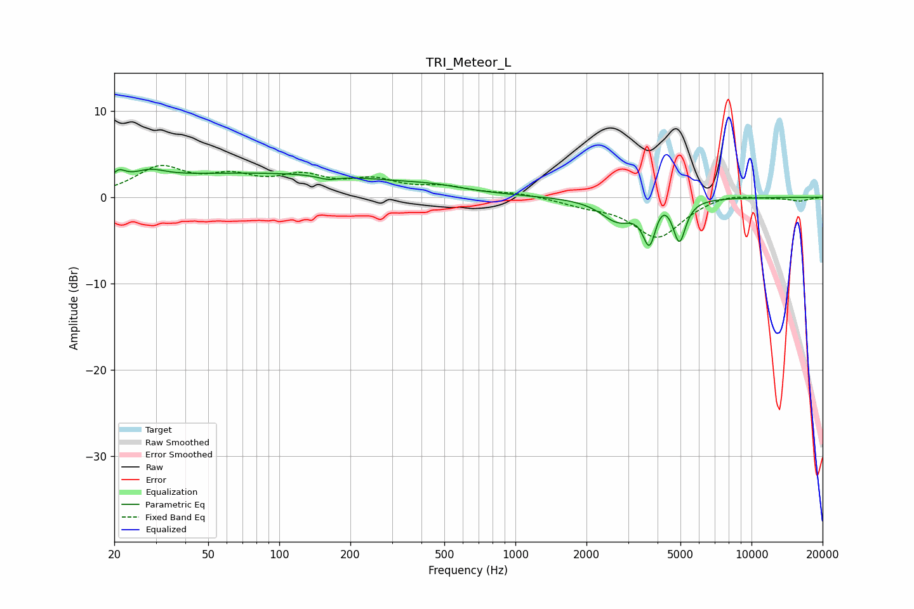

# TRI_Meteor_L
See [usage instructions](https://github.com/jaakkopasanen/AutoEq#usage) for more options and info.

### Parametric EQs
Apply preamp of -3.3 dB when using parametric equalizer.

|   # | Type    |   Fc (Hz) |    Q |   Gain (dB) |
|-----|---------|-----------|------|-------------|
|   1 | Peaking |        20 | 5.83 |        -2.1 |
|   2 | Peaking |        20 | 5.01 |         3   |
|   3 | Peaking |        28 | 2.31 |         0.9 |
|   4 | Peaking |        79 | 0.21 |         2.8 |
|   5 | Peaking |       161 | 3.23 |        -0.5 |
|   6 | Peaking |       454 | 1.2  |         0.4 |
|   7 | Peaking |      2717 | 1.95 |        -2.6 |
|   8 | Peaking |      3701 | 4.93 |        -5.2 |
|   9 | Peaking |      4120 | 3.08 |         1.5 |
|  10 | Peaking |      4946 | 5.23 |        -4.9 |

### Fixed Band EQs
When using fixed band (also called graphic) equalizer, apply preamp of **-3.8 dB** (if available) and set gains manually with these parameters.

|   # | Type    |   Fc (Hz) |    Q |   Gain (dB) |
|-----|---------|-----------|------|-------------|
|   1 | Peaking |        31 | 1.41 |         3.2 |
|   2 | Peaking |        62 | 1.41 |         2   |
|   3 | Peaking |       125 | 1.41 |         2.1 |
|   4 | Peaking |       250 | 1.41 |         1.7 |
|   5 | Peaking |       500 | 1.41 |         1   |
|   6 | Peaking |      1000 | 1.41 |         0.5 |
|   7 | Peaking |      2000 | 1.41 |        -0.7 |
|   8 | Peaking |      4000 | 1.41 |        -4.6 |
|   9 | Peaking |      8000 | 1.41 |         0.6 |
|  10 | Peaking |     16000 | 1.41 |        -0.4 |

### Graphs

