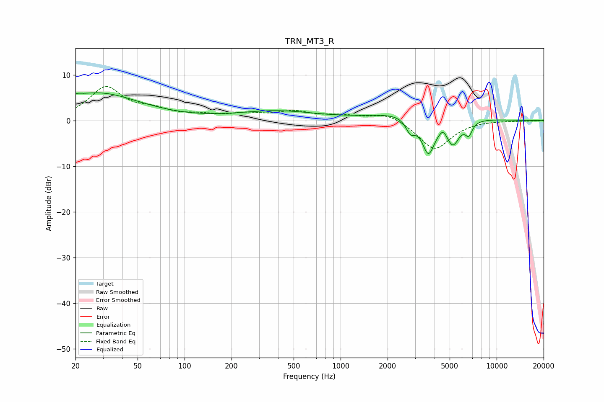

# TRN_MT3_R
See [usage instructions](https://github.com/jaakkopasanen/AutoEq#usage) for more options and info.

### Parametric EQs
Apply preamp of -6.2 dB when using parametric equalizer.

|   # | Type    |   Fc (Hz) |    Q |   Gain (dB) |
|-----|---------|-----------|------|-------------|
|   1 | Peaking |        20 | 5.65 |         0.5 |
|   2 | Peaking |        27 | 0.52 |         6   |
|   3 | Peaking |       389 | 0.56 |         2   |
|   4 | Peaking |      2807 | 4.57 |        -3   |
|   5 | Peaking |      3283 | 4.78 |         0   |
|   6 | Peaking |      3318 | 0.59 |         2.4 |
|   7 | Peaking |      3654 | 3.15 |        -8.6 |
|   8 | Peaking |      4545 | 6    |         1.3 |
|   9 | Peaking |      5243 | 3.15 |        -5.8 |
|  10 | Peaking |      6632 | 6    |        -2.7 |

### Fixed Band EQs
When using fixed band (also called graphic) equalizer, apply preamp of **-7.6 dB** (if available) and set gains manually with these parameters.

|   # | Type    |   Fc (Hz) |    Q |   Gain (dB) |
|-----|---------|-----------|------|-------------|
|   1 | Peaking |        31 | 1.41 |         7.1 |
|   2 | Peaking |        62 | 1.41 |         1.9 |
|   3 | Peaking |       125 | 1.41 |         1   |
|   4 | Peaking |       250 | 1.41 |         1.2 |
|   5 | Peaking |       500 | 1.41 |         1.8 |
|   6 | Peaking |      1000 | 1.41 |         1   |
|   7 | Peaking |      2000 | 1.41 |         1.8 |
|   8 | Peaking |      4000 | 1.41 |        -6.4 |
|   9 | Peaking |      8000 | 1.41 |         0.1 |
|  10 | Peaking |     16000 | 1.41 |        -0   |

### Graphs

