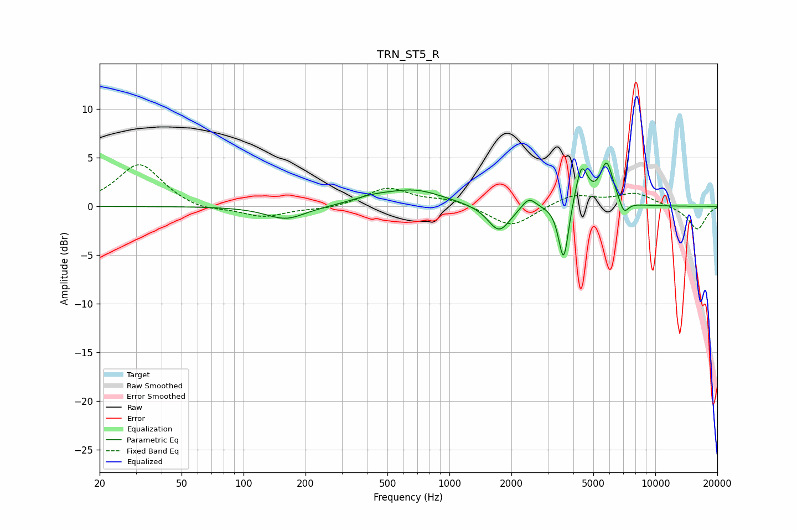

# TRN_ST5_R
See [usage instructions](https://github.com/jaakkopasanen/AutoEq#usage) for more options and info.

### Parametric EQs
Apply preamp of -4.6 dB when using parametric equalizer.

|   # | Type    |   Fc (Hz) |    Q |   Gain (dB) |
|-----|---------|-----------|------|-------------|
|   1 | Peaking |       161 | 1.47 |        -1.4 |
|   2 | Peaking |       418 | 1.46 |         0.6 |
|   3 | Peaking |       679 | 0.99 |         1.6 |
|   4 | Peaking |      1743 | 2.63 |        -2.8 |
|   5 | Peaking |      2431 | 4.12 |         1.2 |
|   6 | Peaking |      3532 | 6    |        -1.1 |
|   7 | Peaking |      3597 | 6    |        -5.1 |
|   8 | Peaking |      4380 | 4.64 |         4.2 |
|   9 | Peaking |      5808 | 4.31 |         4.3 |
|  10 | Peaking |      7042 | 6    |        -1.4 |

### Fixed Band EQs
When using fixed band (also called graphic) equalizer, apply preamp of **-4.4 dB** (if available) and set gains manually with these parameters.

|   # | Type    |   Fc (Hz) |    Q |   Gain (dB) |
|-----|---------|-----------|------|-------------|
|   1 | Peaking |        31 | 1.41 |         4.4 |
|   2 | Peaking |        62 | 1.41 |        -0.6 |
|   3 | Peaking |       125 | 1.41 |        -1.1 |
|   4 | Peaking |       250 | 1.41 |        -0.3 |
|   5 | Peaking |       500 | 1.41 |         1.9 |
|   6 | Peaking |      1000 | 1.41 |         0.7 |
|   7 | Peaking |      2000 | 1.41 |        -2.2 |
|   8 | Peaking |      4000 | 1.41 |         1.2 |
|   9 | Peaking |      8000 | 1.41 |         1.3 |
|  10 | Peaking |     16000 | 1.41 |        -2.4 |

### Graphs

