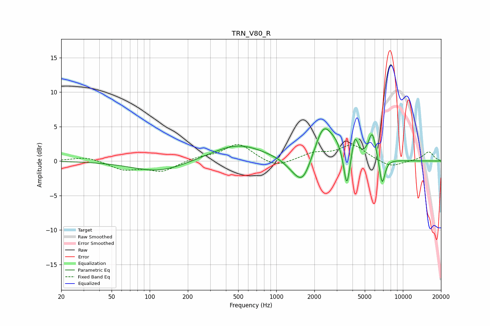

# TRN_V80_R
See [usage instructions](https://github.com/jaakkopasanen/AutoEq#usage) for more options and info.

### Parametric EQs
Apply preamp of -4.8 dB when using parametric equalizer.

|   # | Type    |   Fc (Hz) |    Q |   Gain (dB) |
|-----|---------|-----------|------|-------------|
|   1 | Peaking |       118 | 0.7  |        -1.6 |
|   2 | Peaking |       499 | 0.68 |         2.4 |
|   3 | Peaking |      1353 | 1.89 |        -0.9 |
|   4 | Peaking |      1618 | 2.14 |        -3.6 |
|   5 | Peaking |      2351 | 2.08 |         4.9 |
|   6 | Peaking |      2959 | 2.32 |         1.5 |
|   7 | Peaking |      3606 | 6    |        -5.5 |
|   8 | Peaking |      4185 | 6    |         3.2 |
|   9 | Peaking |      5730 | 4.54 |         4.1 |
|  10 | Peaking |      6857 | 6    |        -4   |

### Fixed Band EQs
When using fixed band (also called graphic) equalizer, apply preamp of **-2.5 dB** (if available) and set gains manually with these parameters.

|   # | Type    |   Fc (Hz) |    Q |   Gain (dB) |
|-----|---------|-----------|------|-------------|
|   1 | Peaking |        31 | 1.41 |         0.7 |
|   2 | Peaking |        62 | 1.41 |        -1.2 |
|   3 | Peaking |       125 | 1.41 |        -1.5 |
|   4 | Peaking |       250 | 1.41 |         0.5 |
|   5 | Peaking |       500 | 1.41 |         2.5 |
|   6 | Peaking |      1000 | 1.41 |        -1.1 |
|   7 | Peaking |      2000 | 1.41 |         1   |
|   8 | Peaking |      4000 | 1.41 |         2.3 |
|   9 | Peaking |      8000 | 1.41 |        -1   |
|  10 | Peaking |     16000 | 1.41 |         1.3 |

### Graphs

