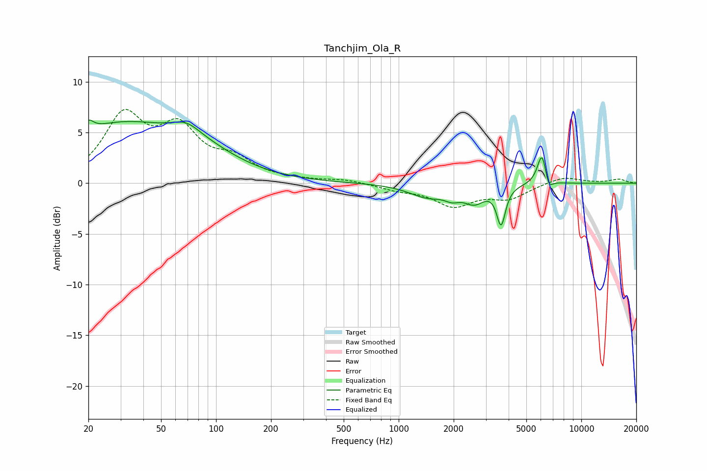

# Tanchjim_Ola_R
See [usage instructions](https://github.com/jaakkopasanen/AutoEq#usage) for more options and info.

### Parametric EQs
Apply preamp of -6.3 dB when using parametric equalizer.

|   # | Type    |   Fc (Hz) |    Q |   Gain (dB) |
|-----|---------|-----------|------|-------------|
|   1 | Peaking |        20 | 5.26 |         1.1 |
|   2 | Peaking |        29 | 0.45 |         5.3 |
|   3 | Peaking |        69 | 1.93 |         1.1 |
|   4 | Peaking |        81 | 0.66 |         2   |
|   5 | Peaking |      1438 | 1.38 |        -1.2 |
|   6 | Peaking |      1966 | 3.47 |        -0.7 |
|   7 | Peaking |      2597 | 2.45 |        -1.6 |
|   8 | Peaking |      3637 | 6    |        -3.7 |
|   9 | Peaking |      6106 | 5.37 |         3.4 |
|  10 | Peaking |      6582 | 5.99 |        -1.5 |

### Fixed Band EQs
When using fixed band (also called graphic) equalizer, apply preamp of **-7.4 dB** (if available) and set gains manually with these parameters.

|   # | Type    |   Fc (Hz) |    Q |   Gain (dB) |
|-----|---------|-----------|------|-------------|
|   1 | Peaking |        31 | 1.41 |         6.3 |
|   2 | Peaking |        62 | 1.41 |         4.8 |
|   3 | Peaking |       125 | 1.41 |         1.9 |
|   4 | Peaking |       250 | 1.41 |         0.2 |
|   5 | Peaking |       500 | 1.41 |         0.3 |
|   6 | Peaking |      1000 | 1.41 |        -0.6 |
|   7 | Peaking |      2000 | 1.41 |        -2.1 |
|   8 | Peaking |      4000 | 1.41 |        -1.4 |
|   9 | Peaking |      8000 | 1.41 |         0.7 |
|  10 | Peaking |     16000 | 1.41 |         0.4 |

### Graphs

