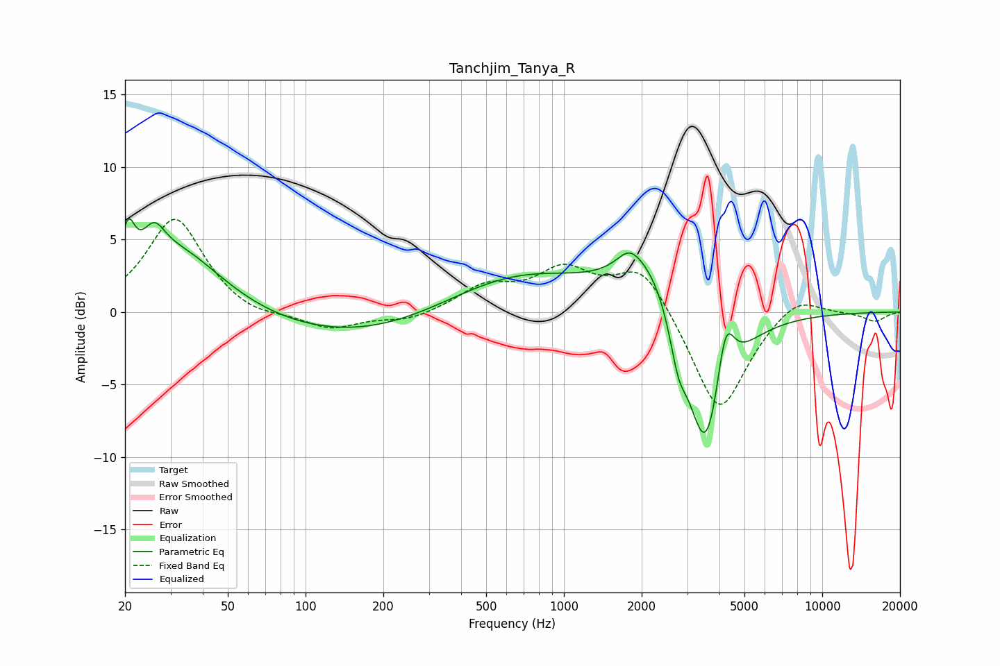

# Tanchjim_Tanya_R
See [usage instructions](https://github.com/jaakkopasanen/AutoEq#usage) for more options and info.

### Parametric EQs
Apply preamp of -6.5 dB when using parametric equalizer.

|   # | Type    |   Fc (Hz) |    Q |   Gain (dB) |
|-----|---------|-----------|------|-------------|
|   1 | Peaking |        21 | 5.54 |         3.2 |
|   2 | Peaking |        26 | 3.29 |         2.2 |
|   3 | Peaking |        32 | 0.81 |         4.3 |
|   4 | Peaking |       183 | 0.35 |        -2.2 |
|   5 | Peaking |       623 | 0.47 |         3.2 |
|   6 | Peaking |      1788 | 3.05 |         1.1 |
|   7 | Peaking |      2180 | 1.14 |         4.3 |
|   8 | Peaking |      2769 | 4.47 |        -2.5 |
|   9 | Peaking |      3547 | 1.75 |       -11.5 |
|  10 | Peaking |      4216 | 4.05 |         4.8 |

### Fixed Band EQs
When using fixed band (also called graphic) equalizer, apply preamp of **-6.5 dB** (if available) and set gains manually with these parameters.

|   # | Type    |   Fc (Hz) |    Q |   Gain (dB) |
|-----|---------|-----------|------|-------------|
|   1 | Peaking |        31 | 1.41 |         6.5 |
|   2 | Peaking |        62 | 1.41 |        -0.6 |
|   3 | Peaking |       125 | 1.41 |        -1.2 |
|   4 | Peaking |       250 | 1.41 |        -0.6 |
|   5 | Peaking |       500 | 1.41 |         1.6 |
|   6 | Peaking |      1000 | 1.41 |         2.7 |
|   7 | Peaking |      2000 | 1.41 |         3.3 |
|   8 | Peaking |      4000 | 1.41 |        -7.2 |
|   9 | Peaking |      8000 | 1.41 |         1.4 |
|  10 | Peaking |     16000 | 1.41 |        -0.6 |

### Graphs

