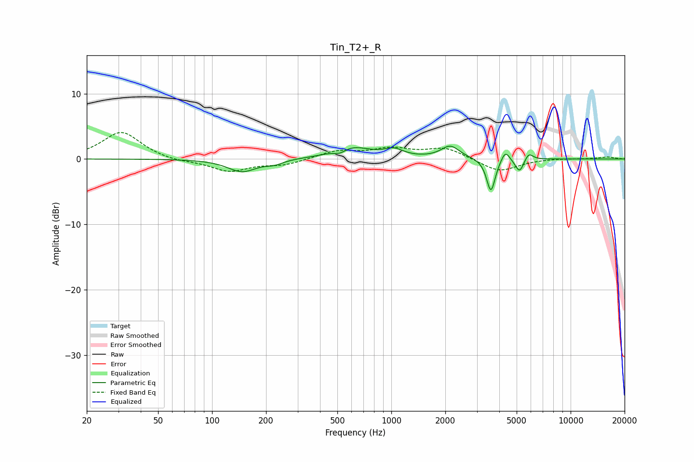

# Tin_T2+_R
See [usage instructions](https://github.com/jaakkopasanen/AutoEq#usage) for more options and info.

### Parametric EQs
Apply preamp of -2.1 dB when using parametric equalizer.

|   # | Type    |   Fc (Hz) |    Q |   Gain (dB) |
|-----|---------|-----------|------|-------------|
|   1 | Peaking |       147 | 1.77 |        -1.9 |
|   2 | Peaking |       223 | 3.01 |        -0.6 |
|   3 | Peaking |       518 | 4.35 |        -0.7 |
|   4 | Peaking |       599 | 1.34 |         1.8 |
|   5 | Peaking |      1033 | 2.7  |         1.1 |
|   6 | Peaking |      2133 | 2.8  |         1.9 |
|   7 | Peaking |      3593 | 5.93 |        -5.1 |
|   8 | Peaking |      4325 | 6    |         1.7 |
|   9 | Peaking |      5192 | 5.93 |        -2.1 |
|  10 | Peaking |      5835 | 6    |         1.2 |

### Fixed Band EQs
When using fixed band (also called graphic) equalizer, apply preamp of **-4.1 dB** (if available) and set gains manually with these parameters.

|   # | Type    |   Fc (Hz) |    Q |   Gain (dB) |
|-----|---------|-----------|------|-------------|
|   1 | Peaking |        31 | 1.41 |         4.2 |
|   2 | Peaking |        62 | 1.41 |        -0.4 |
|   3 | Peaking |       125 | 1.41 |        -1.9 |
|   4 | Peaking |       250 | 1.41 |        -0.9 |
|   5 | Peaking |       500 | 1.41 |         1.2 |
|   6 | Peaking |      1000 | 1.41 |         1.4 |
|   7 | Peaking |      2000 | 1.41 |         1.6 |
|   8 | Peaking |      4000 | 1.41 |        -2   |
|   9 | Peaking |      8000 | 1.41 |         0.1 |
|  10 | Peaking |     16000 | 1.41 |         0.3 |

### Graphs

