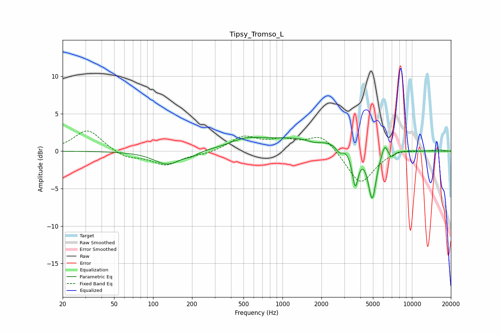

# Tipsy_Tromso_L
See [usage instructions](https://github.com/jaakkopasanen/AutoEq#usage) for more options and info.

### Parametric EQs
Apply preamp of -1.9 dB when using parametric equalizer.

|   # | Type    |   Fc (Hz) |    Q |   Gain (dB) |
|-----|---------|-----------|------|-------------|
|   1 | Peaking |       129 | 1.37 |        -1.8 |
|   2 | Peaking |       201 | 3.5  |        -0.3 |
|   3 | Peaking |       513 | 1.22 |         0.9 |
|   4 | Peaking |      1381 | 0.41 |         1.8 |
|   5 | Peaking |      1745 | 2.55 |        -0.4 |
|   6 | Peaking |      2751 | 5.6  |        -0.9 |
|   7 | Peaking |      3649 | 6    |        -4.8 |
|   8 | Peaking |      4931 | 4.43 |        -6.7 |
|   9 | Peaking |      6156 | 6    |         1.6 |
|  10 | Peaking |      6942 | 6    |        -0.8 |

### Fixed Band EQs
When using fixed band (also called graphic) equalizer, apply preamp of **-2.8 dB** (if available) and set gains manually with these parameters.

|   # | Type    |   Fc (Hz) |    Q |   Gain (dB) |
|-----|---------|-----------|------|-------------|
|   1 | Peaking |        31 | 1.41 |         2.9 |
|   2 | Peaking |        62 | 1.41 |        -0.9 |
|   3 | Peaking |       125 | 1.41 |        -1.8 |
|   4 | Peaking |       250 | 1.41 |        -0.4 |
|   5 | Peaking |       500 | 1.41 |         1.9 |
|   6 | Peaking |      1000 | 1.41 |         1.2 |
|   7 | Peaking |      2000 | 1.41 |         2.2 |
|   8 | Peaking |      4000 | 1.41 |        -4.5 |
|   9 | Peaking |      8000 | 1.41 |         0.4 |
|  10 | Peaking |     16000 | 1.41 |         0.2 |

### Graphs

