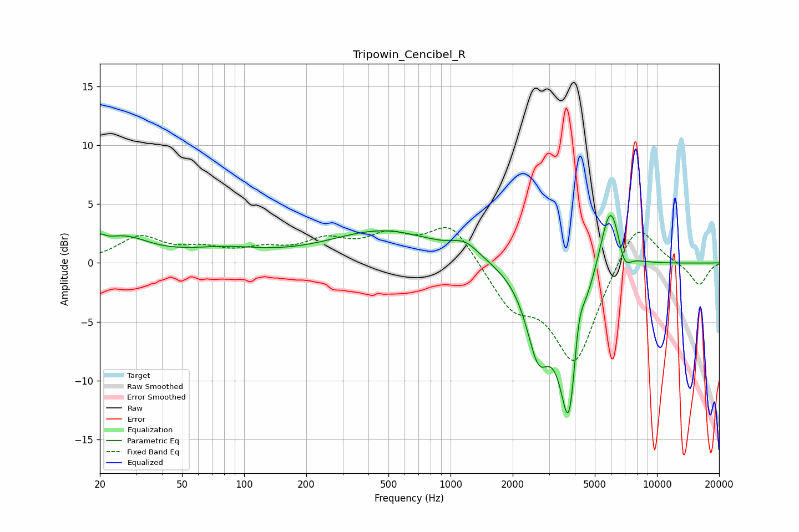

# Tripowin_Cencibel_R
See [usage instructions](https://github.com/jaakkopasanen/AutoEq#usage) for more options and info.

### Parametric EQs
Apply preamp of -4.1 dB when using parametric equalizer.

|   # | Type    |   Fc (Hz) |    Q |   Gain (dB) |
|-----|---------|-----------|------|-------------|
|   1 | Peaking |        20 | 5.77 |         0.8 |
|   2 | Peaking |        26 | 1.1  |         2   |
|   3 | Peaking |        79 | 0.74 |         1   |
|   4 | Peaking |       476 | 0.54 |         2.7 |
|   5 | Peaking |      1176 | 2.17 |         1.1 |
|   6 | Peaking |      2658 | 2.42 |        -6.4 |
|   7 | Peaking |      3756 | 2.85 |       -13.4 |
|   8 | Peaking |      4166 | 5.3  |         3.6 |
|   9 | Peaking |      5958 | 2.67 |         6.5 |
|  10 | Peaking |      6926 | 4.22 |        -2   |

### Fixed Band EQs
When using fixed band (also called graphic) equalizer, apply preamp of **-3.1 dB** (if available) and set gains manually with these parameters.

|   # | Type    |   Fc (Hz) |    Q |   Gain (dB) |
|-----|---------|-----------|------|-------------|
|   1 | Peaking |        31 | 1.41 |         2.1 |
|   2 | Peaking |        62 | 1.41 |         1   |
|   3 | Peaking |       125 | 1.41 |         0.9 |
|   4 | Peaking |       250 | 1.41 |         1.7 |
|   5 | Peaking |       500 | 1.41 |         2   |
|   6 | Peaking |      1000 | 1.41 |         3.4 |
|   7 | Peaking |      2000 | 1.41 |        -3.4 |
|   8 | Peaking |      4000 | 1.41 |        -8.4 |
|   9 | Peaking |      8000 | 1.41 |         4   |
|  10 | Peaking |     16000 | 1.41 |        -1.9 |

### Graphs

