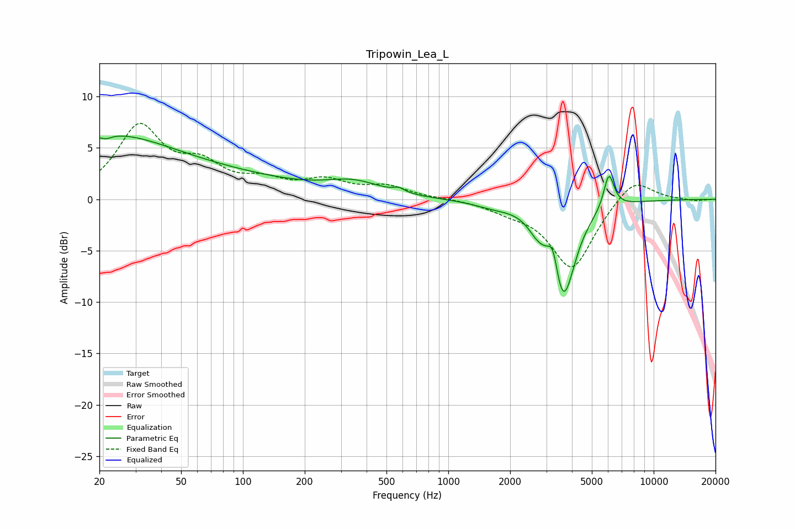

# Tripowin_Lea_L
See [usage instructions](https://github.com/jaakkopasanen/AutoEq#usage) for more options and info.

### Parametric EQs
Apply preamp of -6.2 dB when using parametric equalizer.

|   # | Type    |   Fc (Hz) |    Q |   Gain (dB) |
|-----|---------|-----------|------|-------------|
|   1 | Peaking |        21 | 0.42 |         5.9 |
|   2 | Peaking |        22 | 5.29 |        -0.4 |
|   3 | Peaking |        96 | 0.42 |         1.5 |
|   4 | Peaking |       347 | 1.07 |         1.3 |
|   5 | Peaking |       575 | 5.41 |         0.4 |
|   6 | Peaking |      1646 | 1.44 |        -0.5 |
|   7 | Peaking |      2717 | 3.11 |        -1.2 |
|   8 | Peaking |      3233 | 6    |         2.5 |
|   9 | Peaking |      3626 | 2.41 |        -9.5 |
|  10 | Peaking |      6053 | 5.52 |         3.5 |

### Fixed Band EQs
When using fixed band (also called graphic) equalizer, apply preamp of **-7.5 dB** (if available) and set gains manually with these parameters.

|   # | Type    |   Fc (Hz) |    Q |   Gain (dB) |
|-----|---------|-----------|------|-------------|
|   1 | Peaking |        31 | 1.41 |         6.8 |
|   2 | Peaking |        62 | 1.41 |         2.7 |
|   3 | Peaking |       125 | 1.41 |         1.4 |
|   4 | Peaking |       250 | 1.41 |         1.6 |
|   5 | Peaking |       500 | 1.41 |         1.1 |
|   6 | Peaking |      1000 | 1.41 |         0.1 |
|   7 | Peaking |      2000 | 1.41 |        -0.8 |
|   8 | Peaking |      4000 | 1.41 |        -6.8 |
|   9 | Peaking |      8000 | 1.41 |         2.3 |
|  10 | Peaking |     16000 | 1.41 |        -0.2 |

### Graphs

