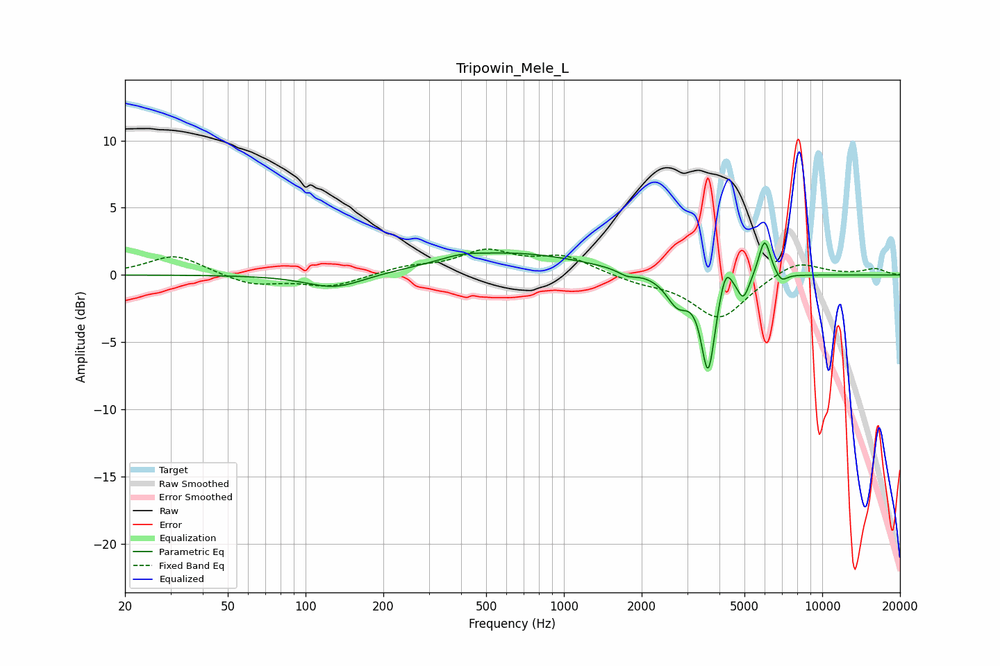

# Tripowin_Mele_L
See [usage instructions](https://github.com/jaakkopasanen/AutoEq#usage) for more options and info.

### Parametric EQs
Apply preamp of -2.5 dB when using parametric equalizer.

|   # | Type    |   Fc (Hz) |    Q |   Gain (dB) |
|-----|---------|-----------|------|-------------|
|   1 | Peaking |       130 | 1.28 |        -1.1 |
|   2 | Peaking |       398 | 1.78 |         0.3 |
|   3 | Peaking |       642 | 0.51 |         1.6 |
|   4 | Peaking |      1760 | 3.94 |        -0.4 |
|   5 | Peaking |      2756 | 3.14 |        -2.1 |
|   6 | Peaking |      3618 | 5.26 |        -7   |
|   7 | Peaking |      4227 | 5.99 |         1.8 |
|   8 | Peaking |      4952 | 6    |        -1.7 |
|   9 | Peaking |      5981 | 5.97 |         2.9 |
|  10 | Peaking |      6940 | 6    |        -0.7 |

### Fixed Band EQs
When using fixed band (also called graphic) equalizer, apply preamp of **-2.0 dB** (if available) and set gains manually with these parameters.

|   # | Type    |   Fc (Hz) |    Q |   Gain (dB) |
|-----|---------|-----------|------|-------------|
|   1 | Peaking |        31 | 1.41 |         1.5 |
|   2 | Peaking |        62 | 1.41 |        -0.8 |
|   3 | Peaking |       125 | 1.41 |        -0.9 |
|   4 | Peaking |       250 | 1.41 |         0.5 |
|   5 | Peaking |       500 | 1.41 |         1.7 |
|   6 | Peaking |      1000 | 1.41 |         1.3 |
|   7 | Peaking |      2000 | 1.41 |        -0.5 |
|   8 | Peaking |      4000 | 1.41 |        -3.3 |
|   9 | Peaking |      8000 | 1.41 |         1.2 |
|  10 | Peaking |     16000 | 1.41 |         0.5 |

### Graphs

