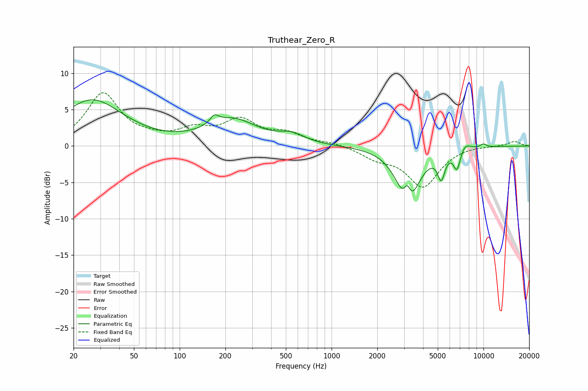

# Truthear_Zero_R
See [usage instructions](https://github.com/jaakkopasanen/AutoEq#usage) for more options and info.

### Parametric EQs
Apply preamp of -6.4 dB when using parametric equalizer.

|   # | Type    |   Fc (Hz) |    Q |   Gain (dB) |
|-----|---------|-----------|------|-------------|
|   1 | Peaking |        26 | 0.7  |         6.3 |
|   2 | Peaking |       169 | 5.14 |         1.1 |
|   3 | Peaking |       223 | 0.88 |         3.5 |
|   4 | Peaking |       548 | 1.73 |         1.2 |
|   5 | Peaking |      3152 | 5.87 |         3.3 |
|   6 | Peaking |      3174 | 2.12 |        -8.7 |
|   7 | Peaking |      5273 | 6    |        -3.3 |
|   8 | Peaking |      6691 | 6    |        -2.7 |
|   9 | Peaking |      7597 | 4.12 |         1   |
|  10 | Peaking |     10000 | 5.99 |         0.5 |

### Fixed Band EQs
When using fixed band (also called graphic) equalizer, apply preamp of **-7.4 dB** (if available) and set gains manually with these parameters.

|   # | Type    |   Fc (Hz) |    Q |   Gain (dB) |
|-----|---------|-----------|------|-------------|
|   1 | Peaking |        31 | 1.41 |         7.1 |
|   2 | Peaking |        62 | 1.41 |         0.6 |
|   3 | Peaking |       125 | 1.41 |         1.9 |
|   4 | Peaking |       250 | 1.41 |         3.3 |
|   5 | Peaking |       500 | 1.41 |         1.5 |
|   6 | Peaking |      1000 | 1.41 |         0.4 |
|   7 | Peaking |      2000 | 1.41 |        -1.4 |
|   8 | Peaking |      4000 | 1.41 |        -5.5 |
|   9 | Peaking |      8000 | 1.41 |         0.1 |
|  10 | Peaking |     16000 | 1.41 |         0.7 |

### Graphs

