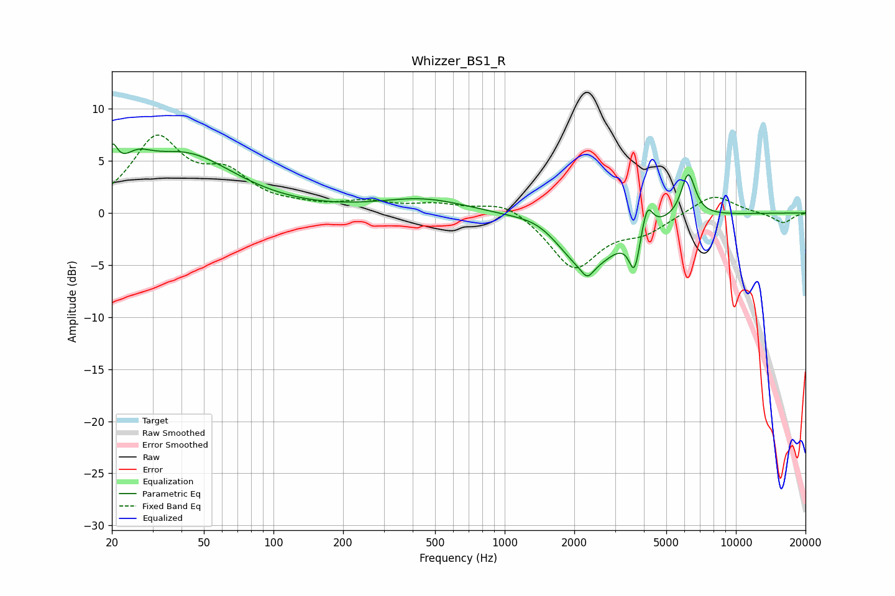

# Whizzer_BS1_R
See [usage instructions](https://github.com/jaakkopasanen/AutoEq#usage) for more options and info.

### Parametric EQs
Apply preamp of -6.7 dB when using parametric equalizer.

|   # | Type    |   Fc (Hz) |    Q |   Gain (dB) |
|-----|---------|-----------|------|-------------|
|   1 | Peaking |        20 | 5.84 |         3   |
|   2 | Peaking |        26 | 2.23 |         1.9 |
|   3 | Peaking |        41 | 0.65 |         5.4 |
|   4 | Peaking |       448 | 0.73 |         1.4 |
|   5 | Peaking |      1445 | 1.29 |         1.2 |
|   6 | Peaking |      2216 | 1.06 |        -5.6 |
|   7 | Peaking |      2277 | 5.9  |        -1   |
|   8 | Peaking |      3644 | 6    |        -3.8 |
|   9 | Peaking |      4130 | 6    |         2.7 |
|  10 | Peaking |      6222 | 4.51 |         4.3 |

### Fixed Band EQs
When using fixed band (also called graphic) equalizer, apply preamp of **-7.6 dB** (if available) and set gains manually with these parameters.

|   # | Type    |   Fc (Hz) |    Q |   Gain (dB) |
|-----|---------|-----------|------|-------------|
|   1 | Peaking |        31 | 1.41 |         6.9 |
|   2 | Peaking |        62 | 1.41 |         3.2 |
|   3 | Peaking |       125 | 1.41 |         0.4 |
|   4 | Peaking |       250 | 1.41 |         0.9 |
|   5 | Peaking |       500 | 1.41 |         0.7 |
|   6 | Peaking |      1000 | 1.41 |         1.3 |
|   7 | Peaking |      2000 | 1.41 |        -5.3 |
|   8 | Peaking |      4000 | 1.41 |        -1.6 |
|   9 | Peaking |      8000 | 1.41 |         1.9 |
|  10 | Peaking |     16000 | 1.41 |        -1   |

### Graphs

