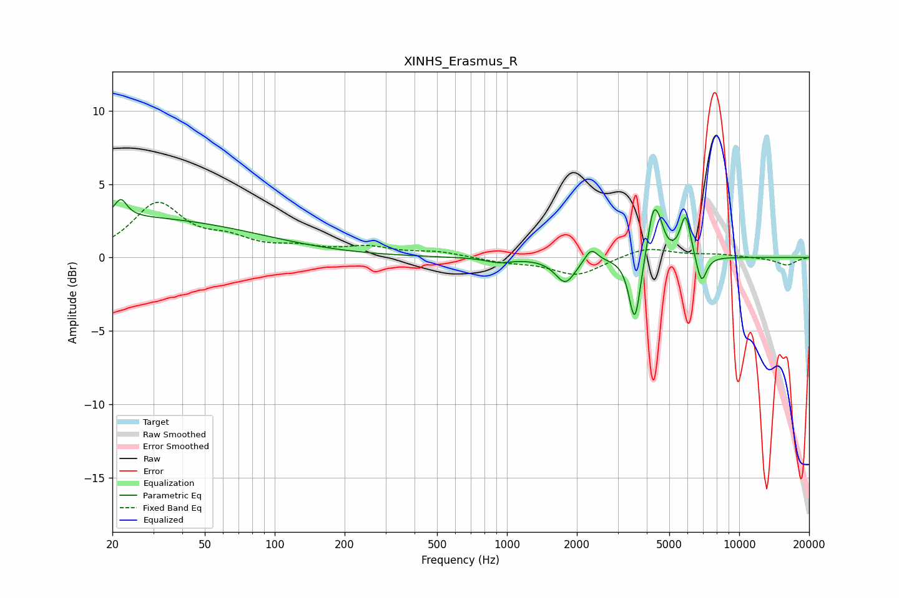

# XINHS_Erasmus_R
See [usage instructions](https://github.com/jaakkopasanen/AutoEq#usage) for more options and info.

### Parametric EQs
Apply preamp of -4.1 dB when using parametric equalizer.

|   # | Type    |   Fc (Hz) |    Q |   Gain (dB) |
|-----|---------|-----------|------|-------------|
|   1 | Peaking |        20 | 0.21 |         2.8 |
|   2 | Peaking |        22 | 5.56 |         1.2 |
|   3 | Peaking |       921 | 2.6  |        -0.3 |
|   4 | Peaking |      1785 | 3.31 |        -1.7 |
|   5 | Peaking |      2304 | 5.27 |         0.9 |
|   6 | Peaking |      3552 | 5.8  |        -4.6 |
|   7 | Peaking |      4258 | 5.82 |         3   |
|   8 | Peaking |      4536 | 6    |         1.3 |
|   9 | Peaking |      5879 | 6    |         2.9 |
|  10 | Peaking |      6872 | 6    |        -2   |

### Fixed Band EQs
When using fixed band (also called graphic) equalizer, apply preamp of **-3.9 dB** (if available) and set gains manually with these parameters.

|   # | Type    |   Fc (Hz) |    Q |   Gain (dB) |
|-----|---------|-----------|------|-------------|
|   1 | Peaking |        31 | 1.41 |         3.6 |
|   2 | Peaking |        62 | 1.41 |         1   |
|   3 | Peaking |       125 | 1.41 |         0.5 |
|   4 | Peaking |       250 | 1.41 |         0.6 |
|   5 | Peaking |       500 | 1.41 |         0.4 |
|   6 | Peaking |      1000 | 1.41 |        -0.3 |
|   7 | Peaking |      2000 | 1.41 |        -1.2 |
|   8 | Peaking |      4000 | 1.41 |         0.7 |
|   9 | Peaking |      8000 | 1.41 |         0.2 |
|  10 | Peaking |     16000 | 1.41 |        -0.5 |

### Graphs

