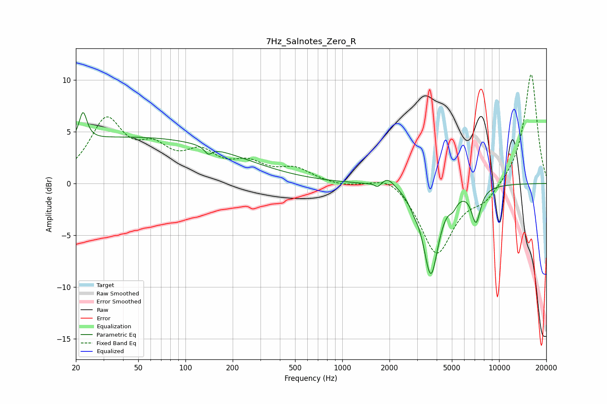

# 7Hz_Salnotes_Zero_R
See [usage instructions](https://github.com/jaakkopasanen/AutoEq#usage) for more options and info.

### Parametric EQs
Apply preamp of -6.9 dB when using parametric equalizer.

|   # | Type    |   Fc (Hz) |    Q |   Gain (dB) |
|-----|---------|-----------|------|-------------|
|   1 | Peaking |        22 | 5.81 |         2.7 |
|   2 | Peaking |        45 | 0.18 |         4.4 |
|   3 | Peaking |       140 | 5.99 |        -0.7 |
|   4 | Peaking |      1643 | 6    |         1.3 |
|   5 | Peaking |      1656 | 6    |        -1.8 |
|   6 | Peaking |      1949 | 3.19 |         0.9 |
|   7 | Peaking |      2859 | 4.72 |        -0.6 |
|   8 | Peaking |      3671 | 2.9  |        -8.6 |
|   9 | Peaking |      5082 | 5.66 |        -0.8 |
|  10 | Peaking |      7124 | 4.59 |        -3.3 |

### Fixed Band EQs
When using fixed band (also called graphic) equalizer, apply preamp of **-10.6 dB** (if available) and set gains manually with these parameters.

|   # | Type    |   Fc (Hz) |    Q |   Gain (dB) |
|-----|---------|-----------|------|-------------|
|   1 | Peaking |        31 | 1.41 |         5.8 |
|   2 | Peaking |        62 | 1.41 |         2.6 |
|   3 | Peaking |       125 | 1.41 |         2.5 |
|   4 | Peaking |       250 | 1.41 |         1.6 |
|   5 | Peaking |       500 | 1.41 |         1.3 |
|   6 | Peaking |      1000 | 1.41 |        -0.3 |
|   7 | Peaking |      2000 | 1.41 |         1.1 |
|   8 | Peaking |      4000 | 1.41 |        -6.8 |
|   9 | Peaking |      8000 | 1.41 |        -1.5 |
|  10 | Peaking |     16000 | 1.41 |        10.7 |

### Graphs

