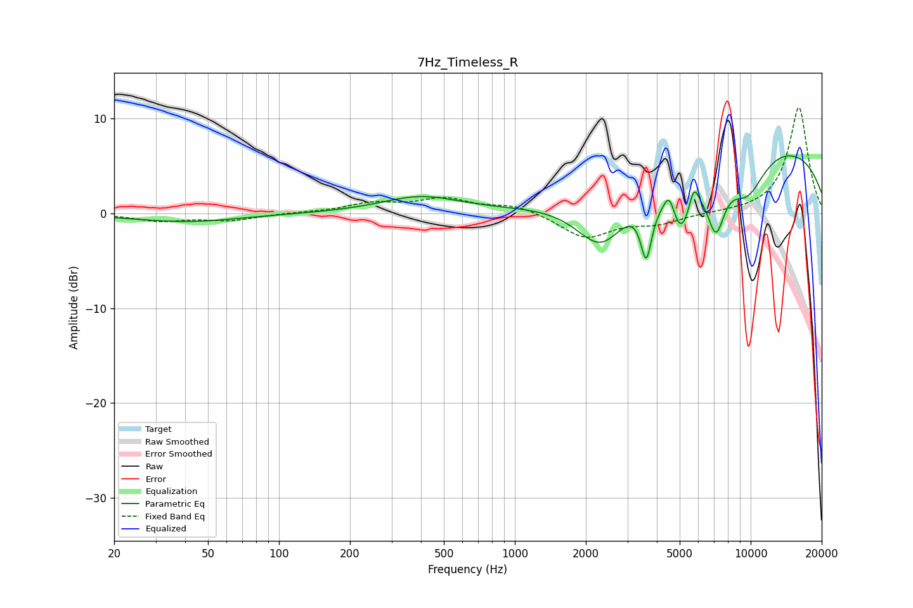

# 7Hz_Timeless_R
See [usage instructions](https://github.com/jaakkopasanen/AutoEq#usage) for more options and info.

### Parametric EQs
Apply preamp of -6.2 dB when using parametric equalizer.

|   # | Type    |   Fc (Hz) |    Q |   Gain (dB) |
|-----|---------|-----------|------|-------------|
|   1 | Peaking |        40 | 0.63 |        -0.9 |
|   2 | Peaking |       398 | 0.85 |         1.7 |
|   3 | Peaking |      2328 | 1.28 |        -6.1 |
|   4 | Peaking |      3607 | 5.9  |        -5.9 |
|   5 | Peaking |      4526 | 5.7  |         2.7 |
|   6 | Peaking |      5069 | 2.38 |        -6.8 |
|   7 | Peaking |      5731 | 5.94 |         2.9 |
|   8 | Peaking |      7127 | 3.56 |        -5.8 |
|   9 | Peaking |      9651 | 1.52 |        -4.7 |
|  10 | Peaking |     10000 | 0.21 |         7.7 |

### Fixed Band EQs
When using fixed band (also called graphic) equalizer, apply preamp of **-11.2 dB** (if available) and set gains manually with these parameters.

|   # | Type    |   Fc (Hz) |    Q |   Gain (dB) |
|-----|---------|-----------|------|-------------|
|   1 | Peaking |        31 | 1.41 |        -0.8 |
|   2 | Peaking |        62 | 1.41 |        -0.7 |
|   3 | Peaking |       125 | 1.41 |         0.1 |
|   4 | Peaking |       250 | 1.41 |         1   |
|   5 | Peaking |       500 | 1.41 |         1.4 |
|   6 | Peaking |      1000 | 1.41 |         0.9 |
|   7 | Peaking |      2000 | 1.41 |        -2.6 |
|   8 | Peaking |      4000 | 1.41 |        -1   |
|   9 | Peaking |      8000 | 1.41 |         0   |
|  10 | Peaking |     16000 | 1.41 |        11.2 |

### Graphs

