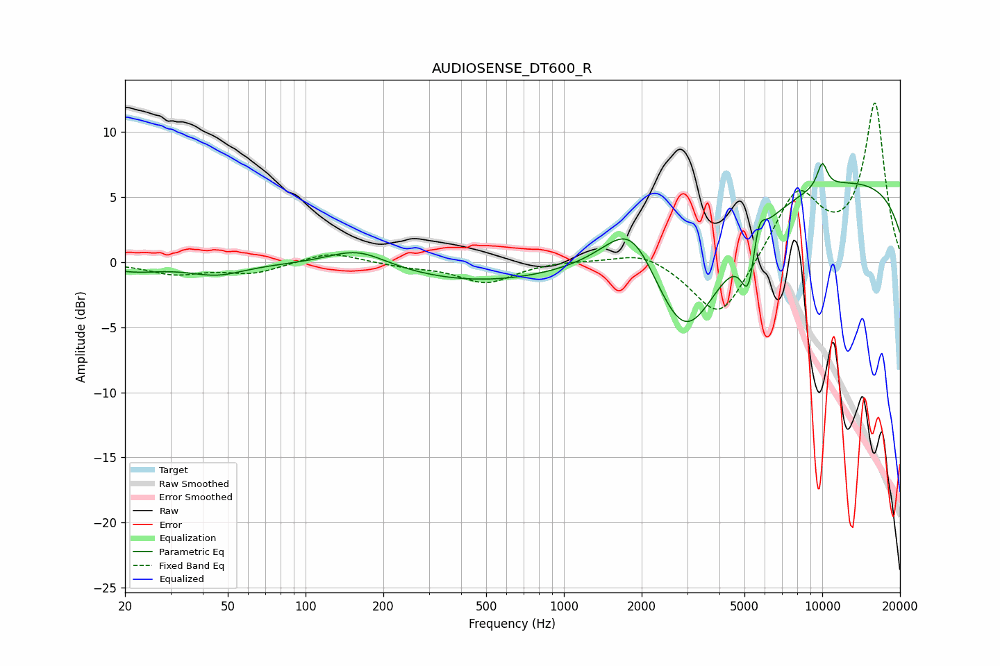

# AUDIOSENSE_DT600_R
See [usage instructions](https://github.com/jaakkopasanen/AutoEq#usage) for more options and info.

### Parametric EQs
Apply preamp of -7.7 dB when using parametric equalizer.

|   # | Type    |   Fc (Hz) |    Q |   Gain (dB) |
|-----|---------|-----------|------|-------------|
|   1 | Peaking |        22 | 1.28 |        -0.6 |
|   2 | Peaking |        45 | 1.31 |        -0.9 |
|   3 | Peaking |       159 | 1.22 |         1.4 |
|   4 | Peaking |       483 | 0.43 |        -1.5 |
|   5 | Peaking |      1836 | 1.3  |         4.9 |
|   6 | Peaking |      2947 | 0.91 |       -10.5 |
|   7 | Peaking |      5186 | 4.81 |        -4.3 |
|   8 | Peaking |      5668 | 5.89 |         2.3 |
|   9 | Peaking |     10000 | 0.18 |         6.6 |
|  10 | Peaking |     10000 | 6    |         1.9 |

### Fixed Band EQs
When using fixed band (also called graphic) equalizer, apply preamp of **-12.3 dB** (if available) and set gains manually with these parameters.

|   # | Type    |   Fc (Hz) |    Q |   Gain (dB) |
|-----|---------|-----------|------|-------------|
|   1 | Peaking |        31 | 1.41 |        -0.9 |
|   2 | Peaking |        62 | 1.41 |        -0.8 |
|   3 | Peaking |       125 | 1.41 |         0.8 |
|   4 | Peaking |       250 | 1.41 |        -0.3 |
|   5 | Peaking |       500 | 1.41 |        -1.6 |
|   6 | Peaking |      1000 | 1.41 |         0.2 |
|   7 | Peaking |      2000 | 1.41 |         0.9 |
|   8 | Peaking |      4000 | 1.41 |        -4.7 |
|   9 | Peaking |      8000 | 1.41 |         5.3 |
|  10 | Peaking |     16000 | 1.41 |        12.1 |

### Graphs

